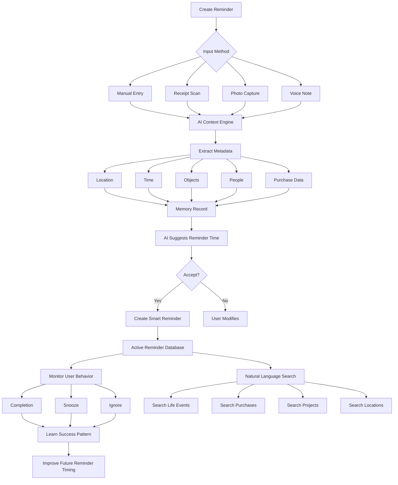

# Breadcrumb
### An AI-Powered Memory, Reminder, and Context Engine

> **Tagline:** *Don't just remember what. Remember why.*

---

# Vision

Today's reminder apps are fundamentally broken.

Users create reminders like:

- Buy printer ink
- Call Teradyne
- Renew passport
- Follow up with supplier

Weeks later, they remember neither:

- Why they created it
- What triggered it
- Whether it still matters
- What information was associated with it

**Breadcrumb** solves this by combining:

- Reminders
- Receipts
- Photos
- Location
- Voice Notes
- AI Memory
- Predictive Timing

Every reminder becomes a searchable memory artifact.

---

# Core Philosophy

Existing Todo Apps:

```text
Task
└── Due Date
```

Breadcrumb:

```text
Task
├── Why
├── When
├── Where
├── Associated Purchase
├── Associated Photo
├── Voice Notes
├── AI Context
├── Completion History
├── Future Suggestions
└── Searchable Memory
```

---

# Key Features

## Memory-Aware Reminders
- Timestamp
- GPS Location
- Photos
- Voice Notes
- Calendar References
- Associated Receipts

## Receipt Intelligence
- OCR receipt scanning
- Consumption trend analysis
- Automatic replenishment reminders
- Purchase history insights

## Location Intelligence
- Trigger reminders when near relevant places
- Store-aware suggestions
- Geo-fenced task execution

## AI Timing Optimization
- Learn completion habits
- Detect snooze patterns
- Recommend optimal reminder times

## Searchable Life Memory

Example queries:
- When did I buy printer ink?
- Show all reminders created in Tokyo.
- Which tasks came from scanned receipts?
- Show everything related to my Smart Display project.

## Future Consequence Engine
- Risk analysis
- Deadline awareness
- Travel and event conflict detection
- Smart urgency scoring

## Project Spaces
- Receipts
- Photos
- Tasks
- Notes
- Milestones
- Purchase tracking

---

# User Flow



---

# Example AI Assistant Briefing

## Daily Brief

```text
Good Morning Aaron

3 reminders due.

You are near:
- Electronics Store
- Hardware Shop

Recommended actions:
- Buy USB-C Hub
- Purchase Solder
```

## Weekly Review

```text
22 Tasks Completed
4 Tasks Ignored
RM2,340 spent
Most Active Project: YieldFather
Most Neglected Project: Family Tree Application
```

---

# Monetization

## Free
- Reminders
- Basic OCR
- Notes
- Timeline

## Premium
- AI Suggestions
- Smart Prediction
- Advanced Search
- Unlimited OCR
- Voice Analysis
- Receipt Intelligence
- Project Spaces

---

# Long-Term Vision

Today:

```text
Reminder App
```

6 Months Later:

```text
Memory Assistant
```

2 Years Later:

```text
Personal Knowledge Graph
```

5 Years Later:

```text
Search Engine For Your Life
```

---

# Why This Could Win

Most reminder apps help users remember tasks.

Breadcrumb helps users remember:

- Tasks
- Decisions
- Purchases
- Projects
- Conversations
- Intent
- Context

The reminder is merely the entry point.

The real product is a searchable second brain for real-world events.
