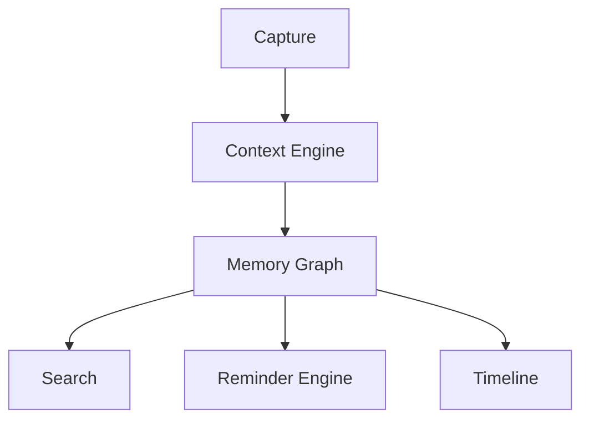

# Breadcrumb Founder Package v1.0

## Vision
Breadcrumb is a memory operating system, not a reminder app. Its mission is to become the Search Engine for Your Life.

# Founder Narrative
People generate thousands of digital artifacts every year: photos, receipts, notes, reminders, conversations, purchases, and projects. These artifacts are disconnected. Breadcrumb connects them into a contextual memory graph.

# Problem
- Users forget why tasks were created.
- Receipts disappear after purchases.
- Projects lose historical context.
- Photos are hard to search by intent.
- Existing reminder apps only track tasks.

# Product Thesis
Reminder + Context + Memory + AI = Personal Life OS

# North Star
When a user asks: "When did I start my Smart Display project?" Breadcrumb instantly answers with timelines, receipts, photos, tasks, and outcomes.

# Core Modules
## 1. Smart Reminders
## 2. Receipt Intelligence
## 3. Memory Graph
## 4. Project Spaces
## 5. Timeline Engine
## 6. AI Recall Assistant
## 7. Travel Mode
## 8. Family Mode
## 9. Engineer Mode

# User Personas
### Busy Professional
Goals, pain points, workflow, retention drivers.

### Parent
Household management and replenishment automation.

### Traveller
Trip memory, receipts, bookings, and experiences.

### Engineer
Action tracking, purchases, defects, project history.

# Detailed Feature Set
## Reminder DNA
Every reminder stores:
- Who
- What
- When
- Where
- Why
- Evidence
- Outcome

## Context Engine
Captures:
- GPS
- Timestamp
- Weather
- Photos
- Voice transcripts
- Calendar events

## Receipt Intelligence
- OCR
- Merchant classification
- Consumption prediction
- Rebuy forecasting
- Subscription detection

## Memory Graph
Nodes:
- People
- Projects
- Purchases
- Places
- Photos
- Tasks
- Trips

# Screens
1. Home Dashboard
2. Capture Screen
3. Reminder Detail
4. Timeline
5. Search
6. Project Space
7. Receipt Vault
8. Travel Workspace
9. AI Assistant
10. Settings

# MVP Scope
- Reminders
- OCR Receipts
- Timeline
- Search
- Project Spaces
- Cloud Sync

# V1 Scope
- AI Timing
- Memory Graph
- Weekly Reviews
- Travel Mode

# V2 Scope
- Shared Spaces
- Family Mode
- Conversational Search
- Predictive Intelligence

# Technical Architecture
## Frontend
- SwiftUI
- WidgetKit
- Live Activities

## Data Layer
- SwiftData
- CloudKit

## AI Layer
- Apple Foundation Models
- Embeddings
- Semantic Search

## OCR
- Vision Framework

# Database Schema
## Reminder
Fields:
- id
- title
- description
- due_date
- status

## Receipt
- merchant
- amount
- category
- items

## MemoryNode
- node_type
- embedding
- relationships

# UX Flow

# Business Model Canvas
## Customers
Consumers, families, professionals.

## Value Proposition
The search engine for your life.

## Revenue
Subscription SaaS.

# Monetization
## Free
Basic reminders and OCR.

## Pro
$4.99/month

## Family
$9.99/month

## Business
$14.99/user/month

# Competitive Landscape
- Apple Reminders
- Todoist
- Notion
- Obsidian
- Rewind

# Moat
Competitors store tasks. Breadcrumb stores context.

# Go To Market
Phase 1: Productivity creators
Phase 2: Travelers
Phase 3: Families
Phase 4: Professionals

# Investor Deck Outline
1. Problem
2. Solution
3. Product
4. Market
5. Business Model
6. Competition
7. Moat
8. Roadmap
9. Team
10. Ask

# 12 Month Roadmap
Q1 MVP
Q2 AI Search
Q3 Family and Travel
Q4 Memory Graph v2

# Success Metrics
- DAU
- WAU
- Reminder Completion Rate
- Searches Per User
- Retention

# Final Positioning
Breadcrumb is not a todo app.

Breadcrumb is a personal memory operating system that turns reminders into a lifelong, searchable knowledge graph.
