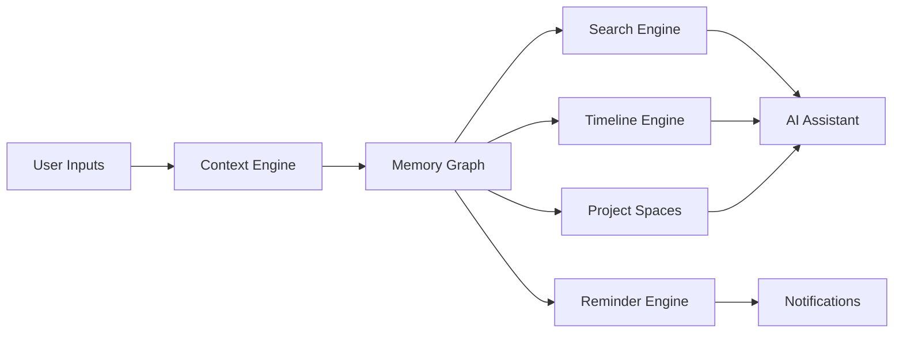
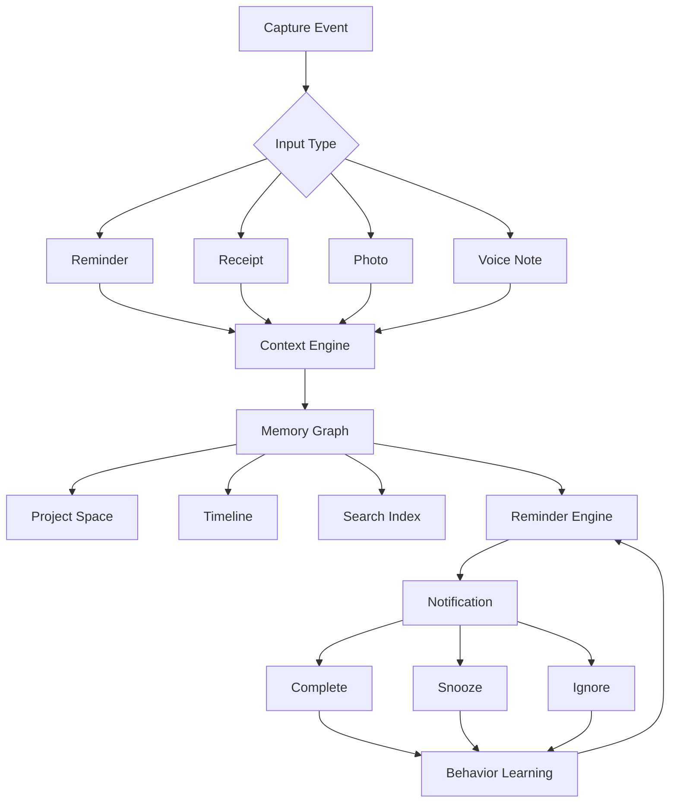

# Breadcrumb
## The Search Engine For Your Life

### Founder Vision

Breadcrumb is not a reminder app.

Breadcrumb is a personal memory operating system that combines reminders, receipts, photos, voice notes, locations, projects, purchases, people, and AI into a single searchable life graph.

---

# Executive Summary

## Mission
Help people remember not only what they need to do, but why they needed to do it, what led to it, and what happened afterwards.

## Tagline
Don't just remember what. Remember why.

## One Line Pitch
The world's first context-aware reminder and memory platform.

---

# Problem Statement

Traditional reminder apps store tasks.

They do not store:
- Intent
- Context
- Evidence
- History
- Outcomes

Example:

Task:
Renew Passport

Missing:
- Why?
- Associated trip?
- Related booking?
- Consequences?

Users suffer from reminder fatigue because reminders lack context.

---

# Product Vision

Stage 1:
Reminder App

Stage 2:
Memory Assistant

Stage 3:
AI Life Search Engine

Stage 4:
Personal Operating System

---

# Core Product Pillars

## Smart Reminders
- Manual input
- OCR input
- Voice input
- Camera input
- Email input
- Share Sheet input

## Context Capture Engine
Automatically captures:
- Timestamp
- GPS
- Calendar events
- Photos
- Voice transcripts
- Receipts
- Nearby people
- Weather

## Receipt Intelligence
- OCR extraction
- Purchase categorization
- Consumption prediction
- Rebuy forecasting
- Subscription detection

## AI Memory Graph
Links:
- Reminders
- Purchases
- People
- Projects
- Locations
- Trips
- Notes
- Photos

## Predictive Timing Engine
Learns:
- Completion patterns
- Ignore patterns
- Time preferences
- Day preferences
- Location preferences

---

# Unique Features

## Reminder DNA

Every reminder stores:

Who
What
When
Where
Why
Outcome

## Why Engine

Example:

Reminder:
Call Supplier

Automatically attached:
- Meeting transcript
- Email thread
- Purchase order
- Associated project

## Future Consequence Engine

Instead of:
Renew Passport

Show:
Failure to renew may impact Japan trip on 24 Dec.

## Smart Consumption Forecasts

Determines:
- Dog food depletion
- Printer ink depletion
- Coffee bean depletion
- Car maintenance intervals

---

# Key User Personas

## Busy Professional

Needs:
- Follow ups
- Bills
- Meetings

## Parent

Needs:
- Family schedules
- Supplies
- School events

## Traveller

Needs:
- Memories
- Expenses
- Travel documents

## Engineer

Needs:
- Project tracking
- Purchase tracking
- Problem tracking

---

# Project Spaces

Each project has:

- Tasks
- Notes
- Receipts
- Photos
- Documents
- Voice notes
- Milestones

Examples:

Smart Display
YieldFather
Family Tree
Home Renovation
Japan Trip

---

# Life Timeline

Example

2026

Bought ESP32
Started Smart Display
Purchased HUB75
Completed OTA Backend

Everything becomes searchable.

---

# AI Search

User asks:

When did I first start YieldFather?

How much have I spent on electronics?

Show reminders created in Penang.

Show unfinished tasks related to Japan.

What did I discuss with Ramesh last month?

---

# Social & Family Edition

Shared Spaces
Shared Purchases
Shared Planning
Shared Travel
Shared Household Inventory

---

# Travel Mode

Automatically creates:

Trip Workspace

Stores:
- Photos
- Receipts
- Hotels
- Flights
- Tasks
- Places visited

Generates automatic travel report.

---

# Engineer Mode

Capture:
- Defects
- SPC issues
- Tester failures
- Yield excursions

Attach:
- Photos
- Notes
- Actions

Track problem lifecycle.

---

# AI Features

## Life Search Assistant
Natural language memory retrieval.

## Weekly Reflection
- Completed tasks
- Active projects
- Spending insights

## Monthly Review
- Projects abandoned
- Habits discovered
- Spending patterns

## Reminder Optimization AI
Learns best notification times.

---

# Technical Architecture

## iOS Frontend
- SwiftUI
- WidgetKit
- Live Activities
- App Intents

## AI Layer
- Apple Foundation Models
- Semantic Search
- Embeddings
- Context Engine

## Storage
- SwiftData
- CoreData
- CloudKit

## OCR
- Vision Framework
- Live Text

## Location
- CoreLocation

---

# High Level Architecture

---

# Full User Flow

---

# Database Model

## Reminder
id
name
description
created_at
due_date
location

## Receipt
id
merchant
amount
purchase_date
items

## MemoryNode
id
type
embedding
context_summary

## Project
id
name
status
category

## Person
id
name
relationship

---

# Monetization

## Free
- 100 reminders
- Timeline
- OCR scans
- AI search limited

## Pro
$4.99/month

- Unlimited reminders
- Unlimited OCR
- AI memory graph
- Smart timing
- Project spaces

## Family
$9.99/month

- Shared workspace
- Household planner
- Shared purchases

## Business
$14.99/user/month

- Team projects
- Meeting memory
- Action tracking

---

# Go-To-Market Strategy

Phase 1
Productivity users

Phase 2
Travel users

Phase 3
Families

Phase 4
Engineers and professionals

---

# Competitive Moat

Competitors own tasks.

Breadcrumb owns context.

Competitors help you remember.

Breadcrumb helps you recall.

---

# Investor Narrative

Every year users create:
- Thousands of photos
- Thousands of purchases
- Thousands of conversations
- Hundreds of tasks

Yet this information remains disconnected.

Breadcrumb connects every life event into a searchable personal memory graph.

The reminder is merely the entry point.

The true product is the search engine for your life.
