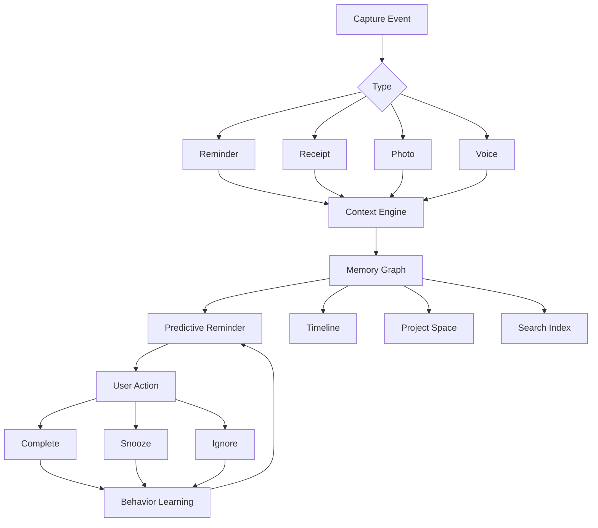

# Breadcrumb
# Startup Product Specification

## Vision

Breadcrumb is an AI-powered memory operating system that uses reminders as the entry point into a searchable personal knowledge graph.

Most reminder apps answer:

> What do I need to do?

Breadcrumb answers:

> Why did I create this?
> What happened before?
> What should happen next?
> What was the outcome?

The long-term goal is to become the search engine for a user's real life.

---

# Executive Summary

## Problem

Traditional reminder apps suffer from:

- Lack of context
- Reminder fatigue
- Poor completion rates
- No memory retention
- No connection between purchases, tasks, projects and life events

Users forget:

- Why a reminder exists
- When it was created
- Associated receipts
- Associated photos
- Related conversations

## Solution

Breadcrumb automatically enriches every reminder with:

- Time
- Location
- Photos
- Voice notes
- Receipts
- People
- Calendar events
- Purchase history
- AI-generated context

The system learns behavior and recommends the best reminder timing.

---

# Market Positioning

## Existing Tools

- Apple Reminders = Task Management
- Todoist = Productivity
- Notion = Knowledge Storage
- Obsidian = Personal Knowledge Base
- Google Photos = Memory Archive
- Splitwise = Expense Management

## Breadcrumb Position

Memory + Context + Action

A personal life operating system.

---

# Target Users

## Persona 1: Busy Professional

Needs:
- Follow-up reminders
- Bill tracking
- Personal tasks
- Travel planning

Pain:
- Forgets why tasks exist

## Persona 2: Parent

Needs:
- Household replenishment
- School reminders
- Family events

Pain:
- Remembering recurring purchases

## Persona 3: Traveler

Needs:
- Trip memories
- Expenses
- Booking reminders

Pain:
- Fragmented information

## Persona 4: Engineer

Needs:
- Project tracking
- Action items
- Purchase tracking
- Documentation

Pain:
- Losing project context

---

# Core Product Pillars

## 1. Smart Reminders

Create reminders through:

- Text
- Voice
- Camera
- Receipt Scan
- Email Forwarding
- Share Sheet

## 2. Context Capture

Automatically store:

- GPS
- Timestamp
- Weather
- Calendar event
- People involved
- Photos
- Voice note transcript

## 3. Receipt Intelligence

OCR extracts:

- Merchant
- Items
- Category
- Cost
- Purchase frequency

Creates future replenishment predictions.

## 4. AI Memory Graph

Everything becomes connected.

Example:

ESP32 Purchase
→ Linked Project
→ Linked Reminder
→ Linked Receipt
→ Linked Photos
→ Linked Notes

## 5. Predictive Reminders

System learns:

- Completion time
- Snooze behavior
- Preferred day
- Preferred location

---

# Product Features

## Feature: Smart Reminder Creation

Input:

- Type
- Speak
- Scan
- Take photo

Output:

- Suggested due date
- Suggested priority
- Suggested project

## Feature: Timeline

Chronological life history.

Example:

2026
- Bought ESP32
- Started Smart Display
- Purchased HUB75
- Completed OTA Module

## Feature: Natural Language Search

Examples:

- When did I first start YieldFather?
- What have I spent on electronics?
- Show all tasks created in Tokyo.

## Feature: Future Risk Analysis

Examples:

Passport expiring before flight.

Car service overdue.

Warranty expiry approaching.

## Feature: Project Spaces

A project contains:

- Tasks
- Receipts
- Notes
- Documents
- Photos
- Conversations

---

# AI Features

## AI Reminder Timing Engine

Learns:

- Open Rate
- Completion Rate
- Ignore Rate

Continuously optimizes reminders.

## AI Context Generator

Creates summaries:

"Created after yield review meeting regarding recurring LLA issue."

## AI Weekly Reflection

Provides:

- Tasks completed
- Money spent
- Active projects
- Neglected projects

## AI Life Search

Conversational search over entire memory graph.

---

# User Experience Flow

---

# Technical Architecture

## Frontend

- SwiftUI
- WidgetKit
- Live Activities
- Apple Intelligence

## Local Storage

- SwiftData
- Core Data

## Cloud Sync

- CloudKit

## AI Layer

- Apple Foundation Models
- On-device embeddings
- Semantic search

## OCR

- Vision Framework
- Live Text

## Location

- CoreLocation

---

# Database Design

## Reminder

- id
- title
- description
- due_date
- location
- context_summary

## Receipt

- merchant
- amount
- date
- image
- items

## Project

- title
- category
- status

## Memory Node

- type
- timestamp
- embedding
- relationships

---

# Monetization

## Free Tier

- 100 reminders
- Basic OCR
- Timeline
- Search

## Pro ($4.99/month)

- Unlimited reminders
- Advanced AI
- Receipt intelligence
- Project spaces
- Memory graph

## Family ($9.99/month)

- Shared spaces
- Shared memories
- Household replenishment

---

# Roadmap

## MVP (3 Months)

- Reminders
- OCR receipts
- Location reminders
- Timeline
- Search

## Version 1 (6 Months)

- AI timing
- Project spaces
- Memory graph
- Weekly reports

## Version 2 (12 Months)

- Shared memories
- Family mode
- Travel mode
- Life analytics

## Version 3 (24 Months)

- Full personal knowledge graph
- Conversational life assistant
- Predictive life planning

---

# Investor Pitch

Today people have:

- Thousands of photos
- Thousands of messages
- Thousands of purchases
- Hundreds of reminders

Yet none are connected.

Breadcrumb connects memories, actions, purchases and context into a single searchable life graph.

The reminder is not the product.

The product is becoming the search engine for your life.
