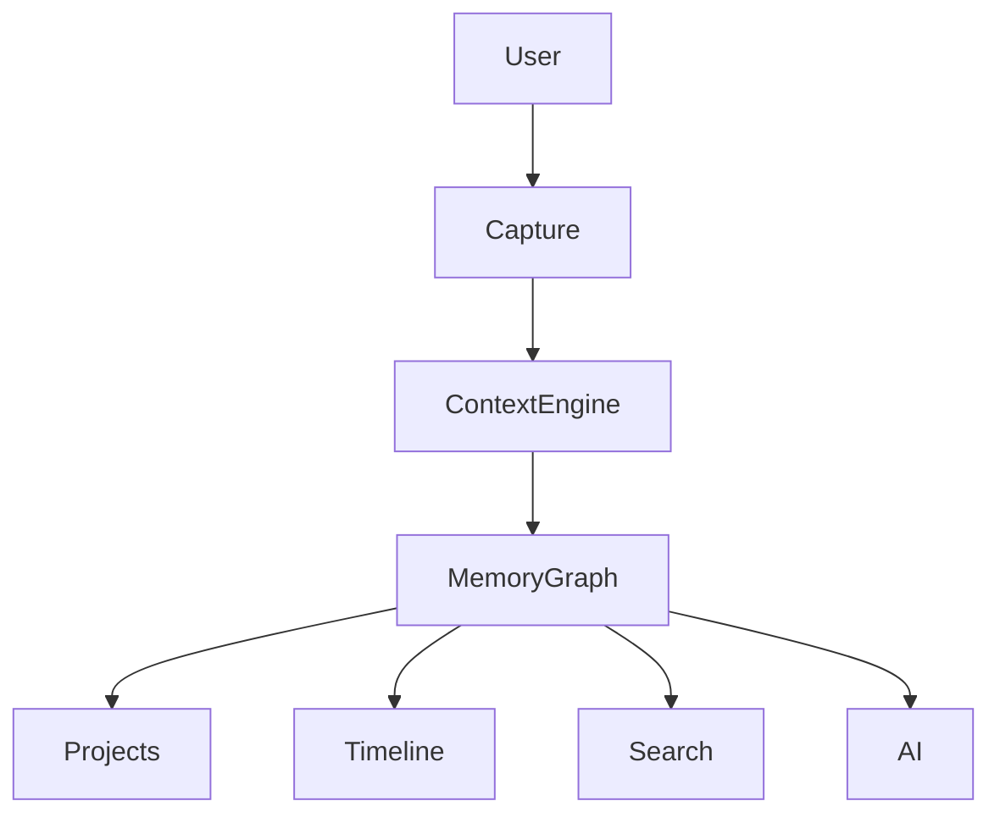

# Breadcrumb Venture Scale Founder Package

# Confidential Founder Document

Version: Venture Package v1.0

## Executive Summary

Breadcrumb is a Personal Memory Operating System.

Unlike reminder apps that manage tasks, Breadcrumb manages context.

Mission:
Create the world's most intelligent personal memory graph.

Vision:
Become the Search Engine for Your Life.

---

# Founder Thesis

People generate:
- Photos
- Receipts
- Reminders
- Notes
- Conversations
- Purchases
- Trips
- Projects

Yet none of these systems are connected.

Breadcrumb connects every life artifact into a semantic memory graph.

---

# Problem

Current tools answer:
"What should I do?"

Users really need answers to:
- Why was this created?
- What caused it?
- What happened next?
- What is related?

---

# Product Vision

Phase 1: Smart Reminder App
Phase 2: Context Engine
Phase 3: Memory Assistant
Phase 4: Life Search Engine
Phase 5: Personal Operating System

---

# Product Pillars

## Pillar 1 - Smart Reminders
- Text
- Voice
- OCR
- Photos
- Email ingestion
- Share sheet

## Pillar 2 - Context Capture
- GPS
- Date
- Time
- Weather
- Calendar
- Images
- Voice notes

## Pillar 3 - Receipt Intelligence
- OCR extraction
- Merchant detection
- Consumption models
- Replenishment predictions

## Pillar 4 - Memory Graph
Nodes:
- People
- Purchases
- Projects
- Reminders
- Notes
- Locations
- Photos

## Pillar 5 - AI Recall Engine
Natural language search.

---

# Ideal Customer Profiles

## Consumer
Personal organization.

## Family
Shared memory and planning.

## Traveler
Trip memory assistant.

## Professional
Knowledge retention.

## Engineers
Project and action tracking.

---

# Detailed Feature Inventory

## Reminder DNA
Every reminder stores:
- Who
- What
- When
- Where
- Why
- Evidence
- Outcome

## Future Consequence Engine
Risk-aware reminders.

## Timeline Engine
Life organized chronologically.

## Project Spaces
Dedicated workspaces.

## Travel Mode
Auto-generated trip knowledge base.

## Family Mode
Shared memory graph.

## Engineer Mode
Issue tracking and context retention.

---

# User Stories

As a traveler, I want every trip receipt categorized automatically.

As an engineer, I want reminders linked to project purchases.

As a parent, I want recurring purchases automatically forecast.

As a professional, I want meeting commitments remembered.

---

# UX Architecture

Home
Capture
Timeline
Search
Projects
Receipts
AI Assistant
Settings

---

# Information Architecture

---

# Technical Stack

Frontend:
- SwiftUI
- WidgetKit
- Live Activities

Storage:
- SwiftData
- CloudKit

AI:
- Apple Foundation Models
- Embeddings
- Semantic Search

OCR:
- Vision Framework

---

# Data Model

Reminder
Receipt
MemoryNode
Project
Trip
Person
Location
Document
Photo

---

# Memory Graph Design

Node Relationships:

Person -> Project
Project -> Reminder
Reminder -> Receipt
Receipt -> Merchant
Project -> Location
Photo -> MemoryNode

---

# AI Roadmap

MVP
- OCR
- Search

V1
- Context summarization

V2
- Conversational memory

V3
- Predictive life assistant

---

# Monetization

Free
Pro
Family
Business
Enterprise

---

# Pricing Strategy

Pro: $4.99
Family: $9.99
Business: $14.99/user

---

# Competitive Analysis

Apple Reminders: Tasks
Todoist: Productivity
Notion: Knowledge
Obsidian: PKM
Rewind: Recall

Breadcrumb: Context + Action + Memory

---

# Competitive Moat

1. Memory Graph
2. Context Capture
3. Receipt Intelligence
4. Predictive Timing
5. Life Search

---

# Growth Strategy

Phase 1
Productivity creators.

Phase 2
Travel creators.

Phase 3
Families.

Phase 4
Professionals.

---

# App Store Strategy

Keywords:
- reminders
- AI memory
- second brain
- life search
- receipt tracker

---

# Fundraising Narrative

The future of productivity is context.

The future of context is memory.

Breadcrumb captures and organizes memory at scale.

---

# TAM SAM SOM

TAM
Global productivity market.

SAM
Knowledge workers and premium consumers.

SOM
Apple ecosystem users.

---

# Investor Deck Structure

1 Problem
2 Opportunity
3 Product
4 Why Now
5 Market
6 Competition
7 Moat
8 Business Model
9 Roadmap
10 Ask

---

# 24 Month Roadmap

Q1 MVP
Q2 AI Search
Q3 Travel Mode
Q4 Family Mode
Year 2 Memory Graph Expansion

---

# Security & Privacy

- On-device processing first
- CloudKit encryption
- User-owned data
- Export capability
- Delete capability

---

# KPIs

DAU
WAU
Retention
Reminder Completion
Search Usage
Projects Created
Receipts Processed

---

# Long-Term Vision

Users will ask:

When did I start this project?

What was discussed?

How much did it cost?

What happened next?

Breadcrumb becomes the memory layer for human life.
