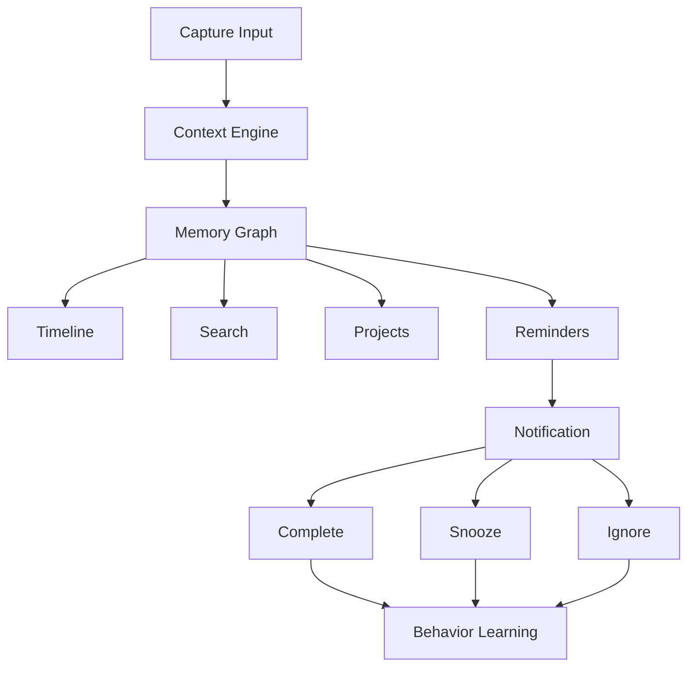

# Breadcrumb Founder Dossier
## Venture-Scale Startup Blueprint
### Version 1.0

---

# Executive Summary

Breadcrumb is a Personal Memory Operating System.

Most productivity applications manage tasks. Breadcrumb manages context, intent, memory, relationships, outcomes, and future actions.

Mission:
Help people remember not just what happened, but why it mattered.

Vision:
Become the Search Engine for Your Life.

---

# Founder Narrative

The modern user is overwhelmed with digital artifacts:

- Photos
- Receipts
- Messages
- Emails
- Reminders
- Notes
- Calendar Events
- Purchases
- Projects

Each lives in its own silo.

Breadcrumb connects them through a contextual memory graph.

---

# Problem Statement

Current reminder apps answer:

"What should I do?"

Users really need answers to:

- Why did I create this?
- What triggered it?
- What information is attached?
- What happened afterward?
- Does it still matter?

---

# Product Positioning

Not:
- Todoist
- Apple Reminders
- Microsoft To Do

Instead:

Breadcrumb = Memory + Context + Recall + Action

Category:

Personal Memory Operating System.

---

# Product Vision Evolution

Stage 1
Reminder App

Stage 2
Context-Aware Reminder Platform

Stage 3
Memory Assistant

Stage 4
Life Search Engine

Stage 5
Personal Operating System

---

# Core Product Pillars

## Pillar 1 – Smart Reminders

Create reminders through:
- Manual input
- Voice
- Camera
- OCR
- Email forwarding
- Share extension

## Pillar 2 – Context Engine

Capture:
- Time
- Date
- Location
- Weather
- Event Context
- Photos
- Voice Notes

## Pillar 3 – Receipt Intelligence

Understand:
- Merchant
- Item
- Category
- Frequency
- Predicted depletion

## Pillar 4 – Memory Graph

Connect:
- People
- Places
- Purchases
- Projects
- Trips
- Tasks
- Memories

## Pillar 5 – AI Recall

Natural-language access to everything.

---

# The Reminder DNA Model

Every reminder stores:

Who
What
When
Where
Why
Evidence
Outcome

---

# Signature Features

## Future Consequence Engine

Instead of:

Renew Passport.

Show:

Failure to renew may affect upcoming travel plans.

## Consumption Prediction

Predict:
- Pet food depletion
- Printer ink depletion
- Coffee consumption
- Household supplies

## Context Resurrection

Show the exact reason a reminder was created.

---

# User Personas

## Professionals

Need follow-up tracking.

## Parents

Need household management.

## Travelers

Need trip memory preservation.

## Engineers

Need project context retention.

## Students

Need assignment and learning recall.

---

# Engineer Persona Expansion

Perfect for:

- Yield investigations
- SPC tracking
- Failure analysis
- Project milestones
- Debug history

Example:

Reminder:
Investigate recurring LLA failure.

Attached:
- Screenshots
- Logs
- Meeting notes
- Receipts
- Action items

---

# Family Mode

Shared Spaces:

- Grocery planning
- Household inventory
- Shared reminders
- School events
- Family trips

---

# Travel Mode

Each trip becomes a workspace.

Stores:

- Flights
- Hotels
- Photos
- Receipts
- Expenses
- Locations
- Memories

Automatically generates:

Trip Summary Report.

---

# Project Spaces

Every project gets:

- Reminders
- Notes
- Photos
- Receipts
- Files
- Timeline
- Activity history

Examples:

- Smart Display
- YieldFather
- Home Renovation
- Japan Trip

---

# Timeline Engine

Creates a searchable chronology.

Example:

2026

Started Smart Display Project
Purchased ESP32 Boards
Built OTA Server
Completed Dashboard

---

# Search Experience

Examples:

When did I start Smart Display?

How much have I spent on ESP32 hardware?

Show projects involving Raj.

Show unfinished reminders from Tokyo.

---

# AI Assistant

Capabilities:

- Life search
- Reminder optimization
- Context summaries
- Weekly reviews
- Monthly insights
- Memory reconstruction

---

# Information Architecture

Home
Capture
Timeline
Search
Projects
Receipts
Memory Vault
Assistant
Settings

---

# UX Flow

---

# Technical Architecture

## Frontend

- SwiftUI
- WidgetKit
- Live Activities
- App Intents

## Storage

- SwiftData
- CloudKit

## AI

- Apple Foundation Models
- Embeddings
- Semantic Search

## OCR

- Vision Framework

---

# Database Entities

Reminder
Receipt
Project
Trip
Person
Location
MemoryNode
Photo
Document
VoiceNote

---

# Memory Graph Model

Person → Project
Project → Reminder
Reminder → Receipt
Receipt → Merchant
Project → Trip
Trip → Photos
Photos → Memory Nodes

---

# MVP Scope

- Reminders
- OCR
- Receipts
- Timeline
- Search
- Cloud Sync

---

# Version 1

- AI Timing
- Project Spaces
- Weekly Reviews
- Travel Mode

---

# Version 2

- Family Sharing
- Conversational Search
- Smart Consumption Models

---

# Version 3

- Predictive Life Assistant
- Advanced Memory Graph
- Business Teams

---

# Monetization

Free

- Basic reminders
- OCR limits

Pro ($4.99)

- Unlimited reminders
- AI search
- Timeline

Family ($9.99)

- Shared workspaces

Business ($14.99/user)

- Team memory graphs

---

# Competitive Landscape

Apple Reminders
Todoist
Notion
Obsidian
Mem.ai
Rewind
Limitless

---

# Competitive Moat

1. Context Capture
2. Memory Graph
3. Receipt Intelligence
4. Predictive Timing
5. Life Search

---

# Go-To-Market

Phase 1
Productivity enthusiasts.

Phase 2
Travel users.

Phase 3
Families.

Phase 4
Professionals and engineers.

---

# App Store Strategy

Keywords:

- reminders
- memory assistant
- second brain
- AI search
- receipt tracker

---

# Fundraising Story

We believe every action creates context.

Existing software stores actions.

Breadcrumb stores context.

That context becomes memory.

That memory becomes intelligence.

---

# TAM / SAM / SOM

TAM
Global productivity and personal knowledge market.

SAM
Premium iPhone users seeking organization.

SOM
Early adopter productivity community.

---

# KPIs

- DAU
- WAU
- MAU
- Retention
- Searches Per User
- Receipts Processed
- Projects Created
- Reminder Completion Rate

---

# Risks

- User onboarding complexity
- Privacy concerns
- AI trustworthiness
- Platform competition

---

# Privacy Strategy

- On-device first
- CloudKit encryption
- User-controlled exports
- User-controlled deletion

---

# 24 Month Roadmap

Q1
MVP

Q2
AI Search

Q3
Travel Mode

Q4
Family Mode

Year 2
Memory Graph Expansion

---

# Investor Deck Outline

1. Problem
2. Vision
3. Product
4. Market
5. Technology
6. Competition
7. Business Model
8. Roadmap
9. Team
10. Funding Ask

---

# Final Founder Statement

Breadcrumb is not a reminder application.

Breadcrumb is a Personal Memory Operating System.

The reminder is only the beginning.

The destination is creating the world's first truly searchable memory layer for everyday life.
