# TimeLore Codebase Study Guide

> A detailed, repository-specific guide to the TimeLore iOS application, its Swift and SwiftUI code, SwiftData persistence, local notifications, tests, Xcode project configuration, resources, and supporting documentation.

**Repository snapshot studied:** August 19, 2026<br>
**Application:** TimeLore<br>
**Minimum deployment target:** iOS 17<br>
**Primary technologies:** Swift, SwiftUI, SwiftData, UserNotifications, Swift Testing, XCTest/XCUITest

> [!IMPORTANT]
> This guide describes the code that exists in the repository at the date above. Recurring reminders and reminder-scoped attachments are approved MVP work, but they are **not implemented in the current Swift source**. Product specifications that describe those features are plans, not evidence that the app already contains them.

## How to use this guide

Read this guide with the project open in Xcode. The file links point to the relevant repository files, and each detailed section uses the line numbers from the current snapshot.

The phrase **line-by-line** is used in a practical sense:

- Consecutive lines that form one Swift statement are explained together.
- Blank lines are treated as visual separators and are not individually described.
- A closing brace is explained with the declaration, closure, condition, function, or type that it closes.
- Repeated framework boilerplate is explained fully the first time and identified more concisely afterward.
- Documentation prose is summarized by authority and purpose. Executable source, tests, project configuration, JSON, XML, and shell code receive line-level commentary.

Suggested workflow:

1. Read the architecture overview.
2. Open the corresponding Swift file beside this guide.
3. Set breakpoints at the functions marked as useful study points.
4. Run the app and observe how state changes affect the UI.
5. Run the associated unit or UI test.
6. Change one small behavior and predict which tests should fail before running them.

## Table of contents

1. [Product and implementation boundary](#1-product-and-implementation-boundary)
2. [Repository structure](#2-repository-structure)
3. [Xcode targets and build products](#3-xcode-targets-and-build-products)
4. [Runtime architecture](#4-runtime-architecture)
5. [Swift language concepts used by TimeLore](#5-swift-language-concepts-used-by-timelore)
6. [Application entry point](#6-application-entry-point)
7. [Domain models](#7-domain-models)
8. [Services](#8-services)
9. [Shared reminder UI components](#9-shared-reminder-ui-components)
10. [Reminder Home](#10-reminder-home)
11. [New and Edit Reminder](#11-new-and-edit-reminder)
12. [Reminder Detail](#12-reminder-detail)
13. [Unit tests](#13-unit-tests)
14. [UI tests](#14-ui-tests)
15. [Xcode project and scheme files](#15-xcode-project-and-scheme-files)
16. [Assets and resources](#16-assets-and-resources)
17. [Project rename script](#17-project-rename-script)
18. [Documentation map](#18-documentation-map)
19. [End-to-end feature traces](#19-end-to-end-feature-traces)
20. [What is deliberately absent](#20-what-is-deliberately-absent)
21. [Recommended study exercises](#21-recommended-study-exercises)
22. [Glossary](#22-glossary)

---

# 1. Product and implementation boundary

TimeLore tests a focused product idea: a reminder should preserve both **what** must be done and **why** it matters.

The currently implemented application supports:

- Create, view, edit, complete, reopen, archive, restore, and delete.
- Required title and optional Notes.
- Optional due date and one-time local notification.
- Independent Priority and Important state.
- Multiple tags and default-tag seeding.
- All, Important, Untagged, and individual-tag filters.
- Case-insensitive title/Notes search.
- Open, Completed, and Archived sections.
- Persistent disclosure and sorting preferences.
- SwiftData local persistence.
- Accessibility labels, values, hints, and UI-test identifiers for core paths.

Approved but not implemented yet:

- Recurring reminder rules and occurrence history.
- Photo, file, and contact-card attachments.

Post-MVP and intentionally out of scope:

- OCR and receipt intelligence.
- AI summaries or semantic search.
- Cloud sync and accounts.
- People/place relationship graphs.
- Timeline, Today, Future, or Insights tabs.

This distinction matters when learning a codebase. A design document expresses intent; a compiled Swift file expresses implemented behavior.

---

# 2. Repository structure

## 2.1 Structural diagram

```mermaid
flowchart TB
    repo["Breadcrumb repository"]

    repo --> project["TimeLore.xcodeproj"]
    repo --> app["TimeLore application target"]
    repo --> unit["TimeLoreTests unit-test target"]
    repo --> ui["TimeLoreUITests UI-test target"]
    repo --> docs["docs current product contracts"]
    repo --> vision["Documentation long-term founder vision"]
    repo --> scripts["scripts maintenance tooling"]

    project --> pbx["project.pbxproj target and build graph"]
    project --> scheme["TimeLore.xcscheme shared actions"]
    project --> workspace["project.xcworkspace workspace metadata"]

    app --> entry["TimeLoreApp.swift entry point"]
    app --> models["Models"]
    app --> services["Services"]
    app --> features["Features/Reminders"]
    app --> resources["Resources/Assets.xcassets"]

    models --> reminder["Reminder.swift"]
    models --> draft["ReminderDraft.swift"]
    models --> tag["ReminderTag.swift"]

    services --> seeder["DefaultReminderTagSeeder.swift"]
    services --> notifications["ReminderNotificationService.swift"]

    features --> home["ReminderListView.swift"]
    features --> editor["ReminderEditorView.swift"]
    features --> detail["ReminderDetailView.swift"]
    features --> chip["ReminderTagChip.swift"]
    features --> presentation["ReminderTagPresentation.swift"]
```

## 2.2 Directory responsibilities

| Path | Responsibility | Included in the app binary? |
|---|---|---:|
| `TimeLore/` | Production application code | Yes |
| `TimeLore/Models/` | Persisted models, domain state, validation, sorting, lifecycle rules | Yes |
| `TimeLore/Services/` | Operations that interact with persistence setup or system services | Yes |
| `TimeLore/Features/Reminders/` | SwiftUI screens and reusable reminder presentation | Yes |
| `TimeLore/Resources/` | Asset catalogs compiled into the app bundle | Yes |
| `TimeLoreTests/` | In-process unit and persistence tests | No; separate test bundle |
| `TimeLoreUITests/` | Out-of-process UI automation | No; separate UI-test bundle |
| `docs/` | Current product, UI, architecture, and study documentation | No |
| `Documentation/` | Older long-term founder and venture material | No |
| `scripts/` | Developer maintenance commands | No |
| `TimeLore.xcodeproj/` | Target graph, build settings, scheme, and workspace metadata | Used by Xcode |

## 2.3 Why there is no `ViewModels` directory

This project deliberately avoids view-model objects that only copy stored properties from SwiftData into another object. Instead:

- Persistent business state lives in `Reminder` and `ReminderTag`.
- Temporary form state lives in `ReminderEditorView` through `@State`.
- Cross-cutting system behavior lives in services.
- Derived list state is calculated by computed properties.

This is still separation of concerns; it simply does not force every screen into an MVVM class.

---

# 3. Xcode targets and build products

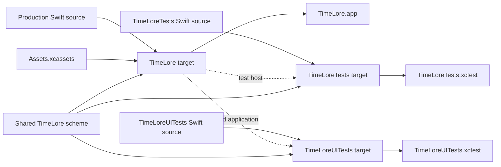

| Target | Xcode product type | What it does |
|---|---|---|
| `TimeLore` | iOS application | Compiles and runs the app |
| `TimeLoreTests` | Unit-test bundle | Loads the app module into a test host and calls internal code |
| `TimeLoreUITests` | UI-testing bundle | Launches a separate app process and interacts through accessibility |

The shared scheme tells Xcode:

- Build the app for running, testing, profiling, analyzing, and archiving.
- Include both test targets during Test.
- Use Debug for Run/Test/Analyze.
- Use Release for Profile/Archive.

---

# 4. Runtime architecture

## 4.1 Main dependency flow

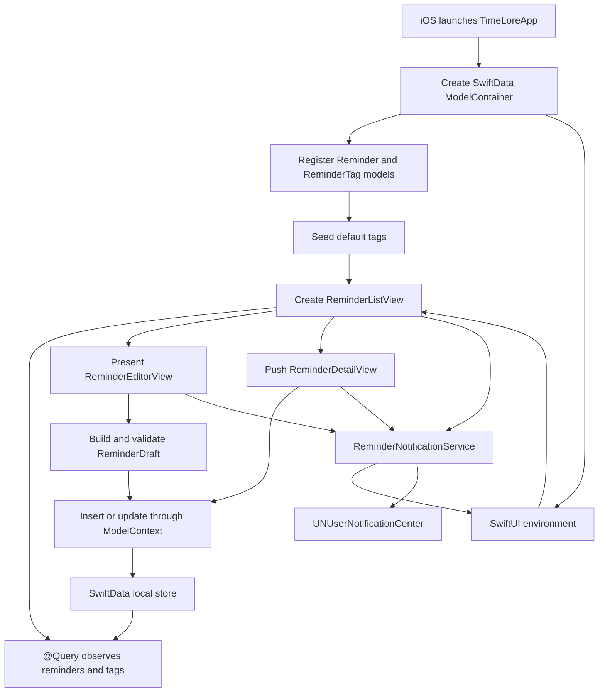

## 4.2 Application launch sequence

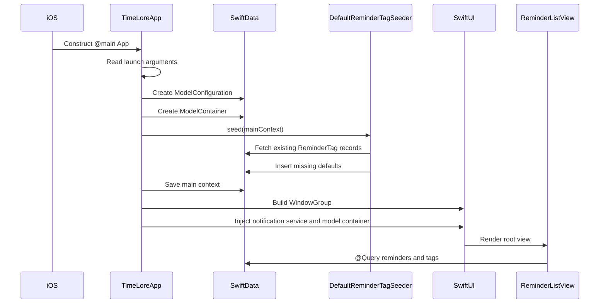

## 4.3 SwiftData relationship

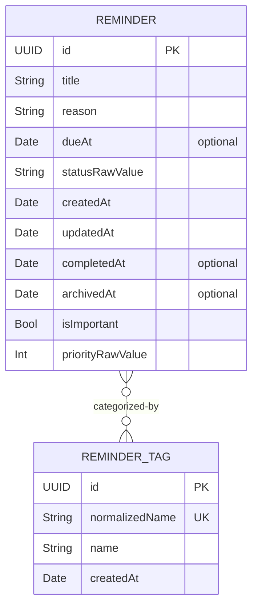

This is a many-to-many relationship:

- One reminder can have many tags.
- One tag can categorize many reminders.
- Deleting a tag nullifies its reminder relationships rather than deleting reminders.

## 4.4 Screen navigation

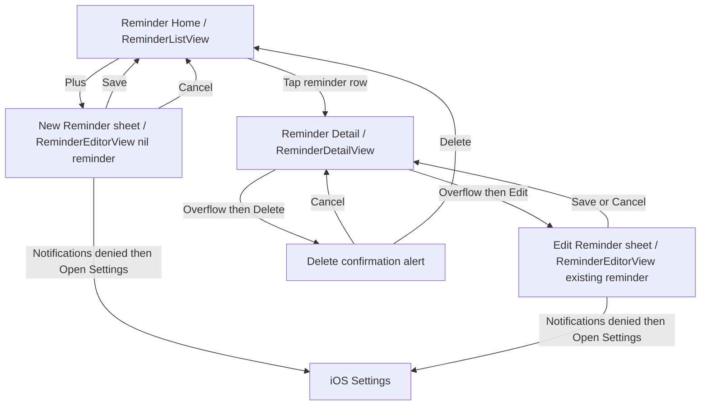

---

# 5. Swift language concepts used by TimeLore

## 5.1 Value types and reference types

`ReminderDraft` is a `struct`, so copying it produces a separate value. It is ideal for temporary form data.

`Reminder` and `ReminderTag` are `final class` SwiftData models. Views and the persistence context share references to the same managed objects. Mutating a fetched `Reminder` changes the object observed by other views.

## 5.2 Optionals

Types ending in `?` can contain a value or `nil`:

```swift
var dueAt: Date?
var completedAt: Date?
var archivedAt: Date?
```

The UI uses `if let` to show content only when these values exist.

## 5.3 Property wrappers

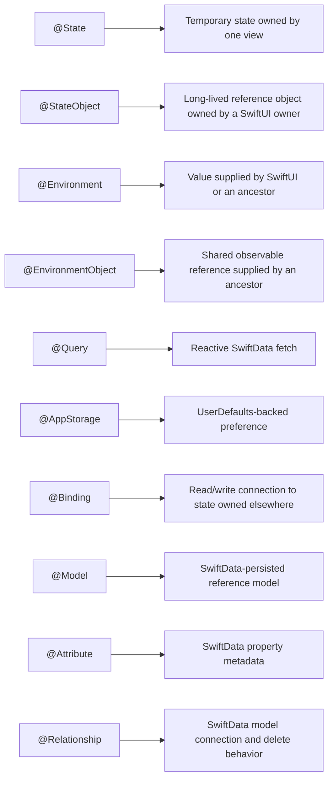

## 5.4 Computed properties

A computed property runs code every time it is read rather than storing a separate value. Examples include:

- `Reminder.status`
- `Reminder.priority`
- `ReminderDraft.normalizedTitle`
- `ReminderListView.filteredReminders`
- `ReminderRowContent.accessibilitySummary`

## 5.5 Protocol-oriented dependency injection

`ReminderNotificationClient` defines behavior without choosing a concrete implementation. Production uses `SystemReminderNotificationClient`; tests use `FakeNotificationClient`.

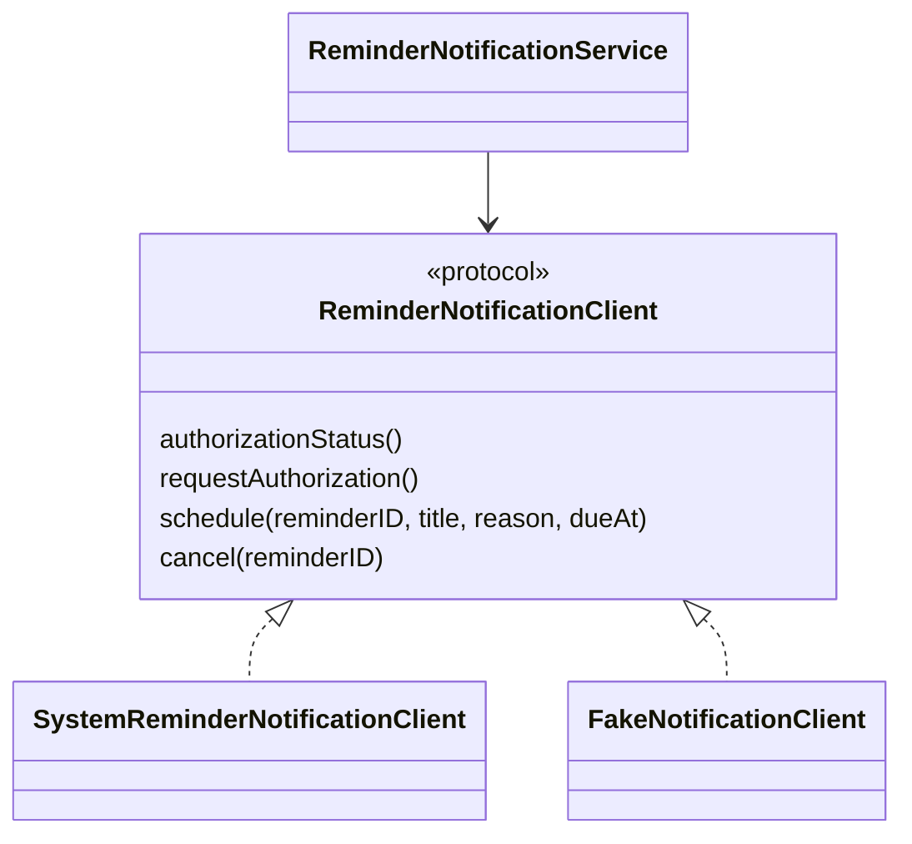

## 5.6 Async/await and `Task`

Notification operations are asynchronous because they communicate with system services. SwiftUI button actions are synchronous closures, so the views start a `Task` and `await` notification work inside it.

## 5.7 Access control

`private` limits implementation details to the current lexical scope or file. TimeLore uses it for:

- Environment values and view state.
- Helper functions.
- Private subviews.
- UI-only enums such as `TagFilter`.
- The fake notification client used only by one test file.

`final` prevents SwiftData model and service classes from being subclassed.

---

# 6. Application entry point

## [`TimeLore/TimeLoreApp.swift`](../TimeLore/TimeLoreApp.swift)

### Purpose

This file is the application’s front door. It creates persistence, seeds initial data, owns the notification service, and supplies both dependencies to the root SwiftUI screen.

### Line-by-line commentary

| Lines | Code responsibility | Detailed explanation | App/UI representation |
|---:|---|---|---|
| 1 | `import Foundation` | Makes `Bundle`, `ProcessInfo`, `UserDefaults`, and general Apple types available. | No direct visual output. |
| 2 | `import SwiftData` | Makes `ModelContainer` and `ModelConfiguration` available. | Enables all locally persisted reminders and tags. |
| 3 | `import SwiftUI` | Makes `App`, `Scene`, `WindowGroup`, views, and property wrappers available. | Enables the application lifecycle and root UI. |
| 5 | `enum AppIdentity` | Uses a caseless enum as a namespace. Because it has no cases, application code cannot accidentally instantiate it. | Central source for the visible app name. |
| 6 | Documentation comment | Explains why the display name is read from build configuration instead of duplicated in source. Xcode surfaces `///` comments in Quick Help. | No runtime UI. |
| 7 | `static var displayName: String` | Declares a type-level computed property; callers use `AppIdentity.displayName`. | Supplies the Home navigation title. |
| 8 | Bundle lookup and fallback | Reads `CFBundleDisplayName`, safely casts to `String`, and falls back to `"TimeLore"` with `??`. | Displays “TimeLore” even if the bundle setting is unexpectedly absent. |
| 9–10 | Closing braces | Close the computed property and namespace. | None. |
| 12 | `@main` | Marks the following type as the executable entry point. Swift permits exactly one entry point. | Causes iOS to launch `TimeLoreApp`. |
| 13 | `struct TimeLoreApp: App` | Declares the root SwiftUI application type and conforms to `App`. | Owns the main app scene. |
| 14 | `private let modelContainer` | Stores one SwiftData container for the life of the app value. It is assigned inside `init`. | Provides the reminder/tag database. |
| 15 | `@StateObject` notification service | Creates and retains one `ReminderNotificationService` across SwiftUI updates. | Supports scheduling/canceling notifications from child screens. |
| 17 | `init()` | Runs when the application object is constructed, before its scene body is rendered. | Performs launch setup. |
| 18 | Read process arguments | Obtains launch arguments supplied by Xcode, tests, or the operating system. | No visible output. |
| 19 | Detect UI testing | Checks for `-ui-testing`. | Makes automated tests isolated and repeatable. |
| 21 | Reset-state condition | Checks for the UI-test-specific reset argument. | Ensures disclosure sections start predictably during UI tests. |
| 22 | Open standard defaults | Gets the app’s `UserDefaults` store. | Accesses saved UI preferences. |
| 23–25 | Remove section keys | Deletes persisted expansion preferences for Open, Completed, and Archived. | UI tests do not inherit a previous test’s collapsed state. |
| 26 | Close reset condition | Ends the conditional reset block. | None. |
| 28 | `do` | Starts error-handling scope for throwing SwiftData initialization. | None. |
| 29 | `ModelConfiguration` | Chooses in-memory storage during UI tests and normal persistent storage otherwise. | Production data survives relaunch; UI-test data does not. |
| 30–34 | Create `ModelContainer` | Registers `Reminder` and `ReminderTag` schemas and applies the configuration. `try` propagates initialization failure into `catch`. | Establishes the database observed by every screen. |
| 35 | Seed tags | Calls the idempotent default-tag service using the main model context. | Makes Work, Personal, Projects, Grocery, Health, and Errands available. |
| 36 | Save context | Commits inserted default tags. | Ensures defaults persist across production launches. |
| 37–39 | `catch` and `fatalError` | Stops launch with a diagnostic if the local store cannot be created. The app has no meaningful degraded mode without persistence. | User does not reach the app UI when initialization catastrophically fails. |
| 40 | Close initializer | Ends startup setup. | None. |
| 42 | `var body: some Scene` | Satisfies `App` and describes the scene hierarchy. `some Scene` is an opaque return type. | Defines the main window. |
| 43 | `WindowGroup` | Creates the application’s primary window scene. | Holds the entire TimeLore UI. |
| 44 | `ReminderListView()` | Instantiates the root screen. | Shows Reminder Home. |
| 45 | `.environmentObject` | Places the notification service in the environment for descendants. | Lets Home, Editor, and Detail access the same service. |
| 46 | Close `WindowGroup` content | Ends the root-view closure. | None. |
| 47 | `.modelContainer` | Places the SwiftData container in the SwiftUI environment. | Enables `@Query` and `@Environment(\.modelContext)`. |
| 48–49 | Closing braces | Close `body` and `TimeLoreApp`. | None. |

### Useful breakpoint

Set a breakpoint on line 35. Relaunch the app and inspect:

- `isUITesting`
- `configuration`
- `modelContainer.mainContext`
- Existing tags before and after seeding

---

# 7. Domain models

## 7.1 [`TimeLore/Models/Reminder.swift`](../TimeLore/Models/Reminder.swift)

### Purpose

This file defines reminder status, priority, persisted fields, legal lifecycle transitions, editing behavior, and deterministic sort rules. It is the central business-domain file.

### `ReminderStatus`, lines 4–7

| Lines | Explanation | UI meaning |
|---:|---|---|
| 1–2 | Import `Foundation` for `UUID`/`Date` and `SwiftData` for model macros. | Enables stored reminder data. |
| 4 | Declares a string-backed enum conforming to `Codable` and `Sendable`. String raw values make storage readable; `Sendable` supports concurrency safety. | Controls which status section contains a reminder. |
| 5 | `.open` has implicit raw value `"open"`. | Appears in Open unless archived. |
| 6 | `.completed` has implicit raw value `"completed"`. | Appears in Completed unless archived. |
| 7 | Closes the enum. | None. |

### `ReminderPriority`, lines 9–22

| Lines | Explanation | UI meaning |
|---:|---|---|
| 9 | Declares an integer-backed, codable, iterable, sendable enum. `CaseIterable` synthesizes `allCases`. | Lets pickers generate all priority options. |
| 10 | `.none = 0`. | No punctuation marker. |
| 11–13 | Levels 1–3 map to integers 1–3. | Displays `!`, `!!`, or `!!!`. |
| 15 | Declares computed `marker`. | Supplies visible priority punctuation. |
| 16 | Repeats `"!"` `rawValue` times. | Converts level 3 into `!!!`. |
| 17 | Closes `marker`. | None. |
| 19 | Declares accessibility description. | Gives VoiceOver meaningful language. |
| 20 | Ternary expression returns “No priority” or a level-and-marker phrase. | VoiceOver does not have to interpret punctuation alone. |
| 21–22 | Close property and enum. | None. |

### Persisted `Reminder`, lines 24–63

| Lines | Explanation | UI/data meaning |
|---:|---|---|
| 24 | `@Model` asks SwiftData to generate persistence and observation support. | Changes can automatically refresh SwiftUI. |
| 25 | `final class Reminder` declares a non-subclassable managed reference type. | Multiple screens can observe the same reminder instance. |
| 26 | Unique UUID identity. | Drives `ForEach`, navigation identity, UI-test identifiers, and notification IDs. |
| 27 | Required title. | Primary row/detail text. |
| 28 | Notes/context stored under the internal name `reason`. | Notes preview and NOTES detail section. |
| 29 | Optional due date. | Optional calendar row and notification time. |
| 30 | Primitive persisted status representation. | Backing storage for `status`. |
| 31 | Creation timestamp. | History section and undated sort tie-breaker. |
| 32 | Last-change timestamp. | History section. |
| 33 | Optional completion timestamp. | Completed sorting and history. |
| 34 | Optional archive timestamp. | Archived membership, sorting, and history. |
| 35 | Explicit independent Important Boolean with default false. | Flag icon, Important filter, Flag/Unflag actions. |
| 36 | Persisted priority integer with none default. | Priority marker and sorting. |
| 37 | Declares relationship metadata: deleting a tag nullifies its relationship to reminders; inverse points to `ReminderTag.reminders`. | Removing a tag never deletes a reminder. |
| 38 | Stores zero or more related tags. | Tag chips and filters. |
| 40 | Declares computed enum-facing `status`. | Gives application code type-safe status access. |
| 41 | Getter converts raw string to enum and falls back to `.open` for unknown data. | Corrupt/legacy status is treated conservatively as open. |
| 42 | Setter converts enum to raw string. | Mutations are persisted through the backing property. |
| 43 | Closes `status`. | None. |
| 45 | Declares computed `priority`. | Gives type-safe priority access. |
| 46 | Getter converts integer and falls back to `.none`. | Unknown stored levels do not crash the UI. |
| 47 | Setter stores the enum raw value. | Picker changes persist as integers. |
| 48 | Closes `priority`. | None. |
| 50 | Initializer accepts validated draft data and injectable time. | Creates a new reminder from the form. |
| 51 | Generates a new UUID. | New reminder and notification identity. |
| 52 | Stores normalized title. | Leading/trailing whitespace never appears in saved UI. |
| 53 | Stores normalized Notes. | Leading/trailing whitespace is removed. |
| 54 | Copies optional due date. | Enables due UI/notification. |
| 55 | Starts status as open. | New reminder appears in Open. |
| 56–57 | Creation and update times begin equal. | Initial history is consistent. |
| 58–59 | New reminder is neither completed nor archived. | No completed/archive history. |
| 60 | Copies Important from the draft. | Editor flag is preserved. |
| 61 | Copies priority raw value. | Editor priority is preserved. |
| 62–63 | Close initializer and class. | None. |

### Lifecycle and editing functions, lines 65–112

| Lines | Function | Detailed behavior | Preserved state |
|---:|---|---|---|
| 65 | `extension Reminder` | Organizes behavior separately from storage declarations without creating a new type. | All model identity remains the same. |
| 66–74 | `update(from:tags:now:)` | Replaces normalized title, Notes, due date, tags, Important, and priority, then updates `updatedAt`. | UUID, creation time, status, completion time, and archive time. |
| 76 | `complete(at:)` | Begins completion transition with injectable time. | Important, priority, tags, due date, archive state. |
| 77 | Guard against repeated completion. | Makes completion idempotent and protects the original completion history. |
| 78 | Set completed status. | Moves an unarchived reminder to Completed. |
| 79 | Record completion time. | Enables history and newest-first Completed sorting. |
| 80 | Record update time. | Shows when lifecycle changed. |
| 81 | Close `complete`. | None. |
| 83 | `reopen(at:)` | Begins reopening transition. | Important, priority, tags, due date, archive state. |
| 84 | Guard against reopening an already-open reminder. | Avoids meaningless timestamp changes. |
| 85 | Set open status. | Moves an unarchived reminder to Open. |
| 86 | Clear completion timestamp. | Removes completed history for the current reminder record. |
| 87 | Record update time. | Reflects reopening. |
| 88 | Close `reopen`. | None. |
| 90 | `archive(at:)` | Begins archive transition. | Open/completed status remains unchanged. |
| 91 | Guard against repeated archive. | Protects original archive timestamp. |
| 92 | Store archive time. | Moves the reminder to Archived. |
| 93 | Store update time. | Reflects archive action. |
| 94 | Close `archive`. | None. |
| 96 | `restore(at:)` | Begins restore transition. | Completion state remains unchanged. |
| 97 | Guard against restoring an unarchived reminder. | Avoids meaningless updates. |
| 98 | Clear archive time. | Returns it to Open or Completed according to status. |
| 99 | Record update time. | Reflects restoration. |
| 100 | Close `restore`. | None. |
| 102 | `setImportant(_:at:)` | Accepts desired flag state and timestamp. | Status, completion, archive, priority, tags. |
| 103 | Guard when value is unchanged. | Prevents false history updates. |
| 104 | Store desired flag. | Updates flag/filter UI. |
| 105 | Record update time. | History reflects flag change. |
| 106 | Close function. | None. |
| 108 | `setPriority(_:at:)` | Accepts desired priority. | Important and lifecycle state. |
| 109 | Guard when unchanged. | Prevents false history updates. |
| 110 | Store through computed priority setter. | Persists raw integer. |
| 111 | Record update time. | History reflects priority change. |
| 112 | Close function. | None. |

### Sorting functions, lines 114–141

| Lines | Function | Rule |
|---:|---|---|
| 114–125 | `openSortOrder` | Both dated: earlier due first, with newer creation as equal-date tie-breaker. Dated beats undated. Both undated: newer creation first. |
| 115 | Optional tuple switch | Pattern matches both reminders’ due-date presence in one expression. |
| 116–117 | Both dates exist | Uses ternary comparison: equal due dates compare creation; otherwise earlier due date wins. |
| 118–119 | Left dated/right undated | Return true, placing left first. |
| 120–121 | Left undated/right dated | Return false, placing right first. |
| 122–123 | Both undated | Newer creation wins. |
| 127–129 | `completedSortOrder` | Newest completion first; missing completion uses `.distantPast` and falls last. |
| 131–136 | `prioritySortOrder` | Higher numeric priority first; equal priority delegates to `openSortOrder`. |
| 138–140 | `archivedSortOrder` | Newest archive first; missing archive uses `.distantPast`. |
| 141 | Close extension | Ends the model behavior block. |

### Reminder state machine

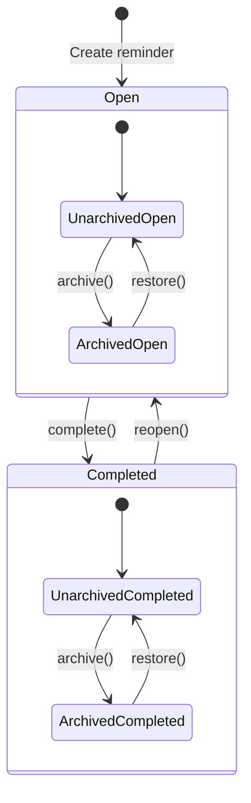

Important and Priority are orthogonal dimensions, not states in this diagram. Either value may change without moving the reminder between Open, Completed, and Archived.

### Useful breakpoints

- Line 66: observe editing and which fields remain unchanged.
- Line 76: observe completion.
- Line 83: observe reopening.
- Line 114: inspect comparator calls while a list is sorted.

## 7.2 [`TimeLore/Models/ReminderDraft.swift`](../TimeLore/Models/ReminderDraft.swift)

### Purpose

`ReminderDraft` is a temporary value representing editor input. It normalizes and validates values before they enter the persisted model.

| Lines | Explanation | App/UI representation |
|---:|---|---|
| 1 | Imports Foundation for trimming character sets and `Date`. | Supports form processing. |
| 3 | Declares an equatable, sendable value type. | Temporary form snapshot; never stored directly in SwiftData. |
| 4 | Empty title default. | Blank title field for creation. |
| 5 | Empty Notes default. | Blank Notes field. |
| 6 | Optional due date. | Due-date toggle can produce `nil`. |
| 7 | Important defaults false. | Flag toggle begins off. |
| 8 | Priority defaults none. | Segmented picker begins at None. |
| 10 | Declares normalized title. | Value used for validation and saving. |
| 11 | Trims leading/trailing spaces and newlines. | `"  Call Maya  "` saves as `"Call Maya"`. |
| 12 | Closes property. | None. |
| 14–16 | Performs identical trimming for Notes. | Removes accidental boundary whitespace while preserving internal content. |
| 18 | Declares validation function with injectable current time and optional permitted original date. Returns a message or `nil`. | Drives inline form errors. |
| 19–21 | Rejects empty normalized title. | Shows “Enter a reminder title.” |
| 23–25 | Rejects more than 200 title characters. | Protects product limit. |
| 27–29 | Rejects more than 2,000 Notes characters. | Protects product limit. |
| 31 | Optional binding unwraps `dueAt`; rejects dates at/before now unless identical to the existing edited value. | New reminders require future dates, but editing unrelated fields on an overdue reminder remains possible. |
| 32 | Returns due-date error. | Shows “Choose a future date and time.” |
| 35 | Returns `nil` after all checks pass. | Save may continue. |
| 36–37 | Close function and struct. | None. |

### Validation flow

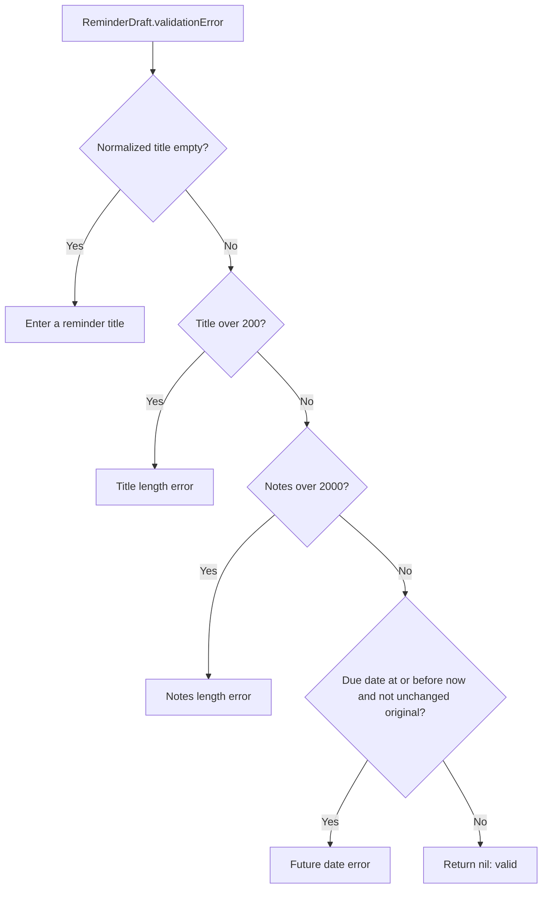

## 7.3 [`TimeLore/Models/ReminderTag.swift`](../TimeLore/Models/ReminderTag.swift)

### Purpose

This file defines stored tags, their stable normalized identity, their many-to-many reminder relationship, and validation.

| Lines | Explanation | App/UI representation |
|---:|---|---|
| 1–2 | Import Foundation and SwiftData. | Enables text normalization, timestamps, and persistence. |
| 4 | `@Model` makes the tag persistable and observable. | Tag changes can refresh chip lists. |
| 5 | Declares final managed reference class. | SwiftData owns tag identity. |
| 6 | Unique UUID. | `ForEach` identity and persistence identity. |
| 7 | Unique normalized name. | Prevents case/whitespace-equivalent duplicates. |
| 8 | Display name. | Visible chip label. |
| 9 | Creation time. | Stable model metadata. |
| 10 | Inverse reminder collection. | A tag can categorize many reminders. |
| 12 | Initializer accepts raw name and injectable creation time. | Used by default seeding and user-created tags. |
| 13 | Produces trimmed display spelling once. | Avoids repeated trimming and inconsistent assignments. |
| 14 | Generates UUID. | New tag identity. |
| 15 | Stores display spelling. | Preserves capitalization such as `WORK`. |
| 16 | Stores normalized identity derived from display spelling. | Matching and uniqueness use case-insensitive identity. |
| 17 | Stores creation time. | Metadata. |
| 18 | Close initializer. | None. |
| 20–22 | `displayName(from:)` trims boundary whitespace/newlines. | `"  WORK \n"` displays as `WORK`. |
| 24 | Declares normalized-name function. | Centralizes identity rules. |
| 25 | Trims first, then starts Unicode folding. | Prevents spaces from affecting identity. |
| 26 | Uses case-insensitive folding. | `Work` and `WORK` become equivalent. |
| 27 | Uses stable `en_US_POSIX` locale. | Avoids user-locale-specific machine identity changes. |
| 28–29 | Close folding call and function. | None. |
| 31 | Declares tag validation. | Drives New tag inline errors. |
| 32 | Calculates trimmed display name once. | All validation uses user-visible content. |
| 34–36 | Rejects blank names. | Shows “Enter a tag name.” |
| 38–40 | Rejects more than 30 characters. | Shows tag length error. |
| 42 | Returns `nil` for valid names. | Tag can become pending. |
| 43–44 | Close function and class. | None. |

---

# 8. Services

## 8.1 [`TimeLore/Services/DefaultReminderTagSeeder.swift`](../TimeLore/Services/DefaultReminderTagSeeder.swift)

### Purpose

This launch-time service guarantees that the six default tags exist without creating duplicates on every relaunch.

| Lines | Explanation | App/UI representation |
|---:|---|---|
| 1 | Imports SwiftData for `ModelContext` and `FetchDescriptor`. | Enables the service to inspect and insert tag records. |
| 3 | `@MainActor` isolates the namespace’s operations to the main actor, matching the main SwiftData context. | Prevents unsafe main-context use from another concurrency executor. |
| 4 | Caseless enum used as a namespace. | No seeder instance is required. |
| 5 | Stores the exact six default names in product order. | Work, Personal, Projects, Grocery, Health, Errands. |
| 7 | Declares throwing `seed(in:)`. The caller supplies the context and owns saving. | Runs during launch. |
| 8 | Fetches all existing tags. | Checks what the user/database already contains. |
| 9 | Maps to normalized names and creates a `Set` for efficient membership checks. | Makes comparison case-insensitive and whitespace-stable. |
| 11 | Loops through defaults only where normalized identity is absent. | Makes the operation idempotent. |
| 12 | Inserts a newly initialized tag into the context. | Missing default chip becomes available. |
| 13–15 | Close loop, function, and namespace. | None. |

### Idempotence diagram

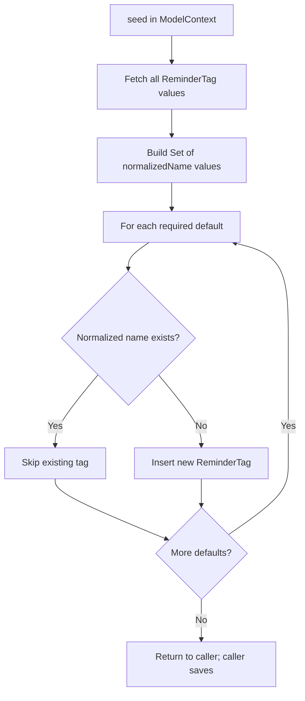

Running this function once or twenty times produces the same final set of default identities.

## 8.2 [`TimeLore/Services/ReminderNotificationService.swift`](../TimeLore/Services/ReminderNotificationService.swift)

### Purpose

This file isolates Apple’s notification framework behind a protocol, defines when a reminder deserves a notification, and reconciles the pending system request with current reminder state.

### Authorization abstraction, lines 1–8

| Lines | Explanation | Runtime meaning |
|---:|---|---|
| 1 | Imports Foundation for `Date`. | Notification due time. |
| 2 | Imports UserNotifications. | Access to Apple notification APIs. |
| 4 | Declares a small application-specific authorization enum. | Prevents UI/domain code from depending on every system authorization case. |
| 5 | Permission has never been requested. | Service may request in context. |
| 6 | Notifications are usable. | Service may schedule. |
| 7 | Permission is unavailable or denied. | Saving continues; UI may show guidance. |
| 8 | Closes enum. | None. |

### Client protocol, lines 10–15

| Line | Requirement | Why it exists |
|---:|---|---|
| 10 | Declares `ReminderNotificationClient`. | Creates an interface shared by real and fake clients. |
| 11 | Read current authorization asynchronously. | System settings access is asynchronous. |
| 12 | Request authorization asynchronously. | System prompt returns later. |
| 13 | Schedule one reminder by stable ID and content. | Production creates a system request; tests record the call. |
| 14 | Cancel by stable ID. | Removes pending work when reminder no longer qualifies. |
| 15 | Closes protocol. | None. |

### System client, lines 17–60

| Lines | Explanation | App/system effect |
|---:|---|---|
| 17 | Concrete protocol implementation. | Used by default in production. |
| 18 | Holds the singleton current notification center. | Communicates with iOS notification storage. |
| 20 | Begins status lookup. | No UI prompt occurs. |
| 21 | Awaits current system settings. | Reads permission state. |
| 22 | Switches across Apple authorization cases. | Maps framework detail into app policy. |
| 23–24 | Authorized, provisional, and ephemeral all map to app-authorized. | Any usable delivery permission allows scheduling. |
| 25–26 | System not-determined maps directly. | Allows contextual prompt decision. |
| 27–28 | Every other case maps to denied. | Restricted/denied conditions become non-schedulable. |
| 29–30 | Close switch and function. | None. |
| 32 | Begins permission request. | Called only when policy/caller permits. |
| 33 | `do` starts throwing request handling. | A system request can fail. |
| 34 | Requests alert, badge, and sound options. | Defines notification capabilities requested from user. |
| 35 | Converts granted Boolean into app enum. | Simplifies later policy. |
| 36–38 | Any thrown error maps to denied. | Reminder saving is not blocked by system failure. |
| 39 | Closes request function. | None. |
| 41 | Begins scheduling function. | Nonthrowing protocol surface. |
| 42 | Removes existing request with same identifier. | Guarantees replacement rather than duplicates. |
| 44 | Creates mutable notification content. | Prepares visible notification. |
| 45 | Uses reminder title as notification title. | User sees the task. |
| 46 | Uses Notes or fallback body text. | Preserves context when available. |
| 47 | Selects default sound. | Produces standard audible alert when allowed. |
| 49–52 | Creates calendar trigger from calendar/timezone/year/month/day/hour/minute components; `repeats` is false. | One-time delivery at the selected local date/time. |
| 53 | Creates request using reminder UUID string. | Stable ID supports exact replacement/cancellation. |
| 54 | Adds request and intentionally suppresses an error with `try?`. | Scheduling failure currently has no dedicated UI state. |
| 55 | Closes schedule. | None. |
| 57–59 | Cancellation removes request matching the UUID string. | Completing/deleting/removing valid due state cancels pending work. |
| 60 | Closes concrete client. | None. |

### Policy and service, lines 62–104

| Lines | Explanation | Behavior |
|---:|---|---|
| 62 | Caseless `ReminderNotificationPolicy` namespace. | Centralizes pure decision logic. |
| 63 | Declares `shouldSchedule` with injectable `now`. | Can be unit tested deterministically. |
| 64 | Requires open status and a due date later than now; missing date becomes `.distantPast`. | Completed, undated, and overdue reminders do not qualify. |
| 65–66 | Close function/namespace. | None. |
| 68 | Main-actor isolation for observable service. | UI calls remain actor-safe. |
| 69 | Final `ObservableObject` service. | Can be injected through SwiftUI environment. |
| 70 | Stores any client conforming to the protocol. | Supports production/fake substitution. |
| 72 | Initializer defaults to real system client. | App needs no manual construction details. |
| 73 | Stores injected client. | Tests gain call visibility. |
| 74 | Closes initializer. | None. |
| 76 | Documentation comment defines returned Boolean narrowly. | Prevents callers from treating it as generic success/failure. |
| 77 | Begins `reconcile`. Caller chooses whether first-time prompting is allowed. | Used after save and lifecycle actions. |
| 78 | Guard tests pure scheduling policy. | Early cancellation path. |
| 79 | Cancels request for unqualified reminder. | Pending system state matches model. |
| 80 | Returns no guidance. | Completing/past date is not a permission error. |
| 81 | Closes guard. | None. |
| 83 | Reads current authorization. | Determines next action. |
| 84 | Checks both not-determined status and caller permission to prompt. | Prevents permission prompt at launch or arbitrary lifecycle actions. |
| 85 | Requests permission and replaces local authorization value. | Continues based on user response. |
| 86 | Closes condition. | None. |
| 88 | Requires authorization and a real due date. | Safety gate before scheduling. |
| 89 | Returns true only for denied authorization. | Editor decides whether to show Settings guidance. |
| 90 | Closes guard. | None. |
| 92–97 | Schedules using reminder ID, title, Notes, and due date. | Creates/replaces one pending request. |
| 98 | Returns false after normal schedule. | No denied alert. |
| 99 | Closes reconciliation. | None. |
| 101–103 | Convenience cancellation accepts an entire `Reminder` and forwards its UUID string. | Detail deletion can cancel before model deletion. |
| 104 | Closes service. | None. |

### Notification reconciliation flow

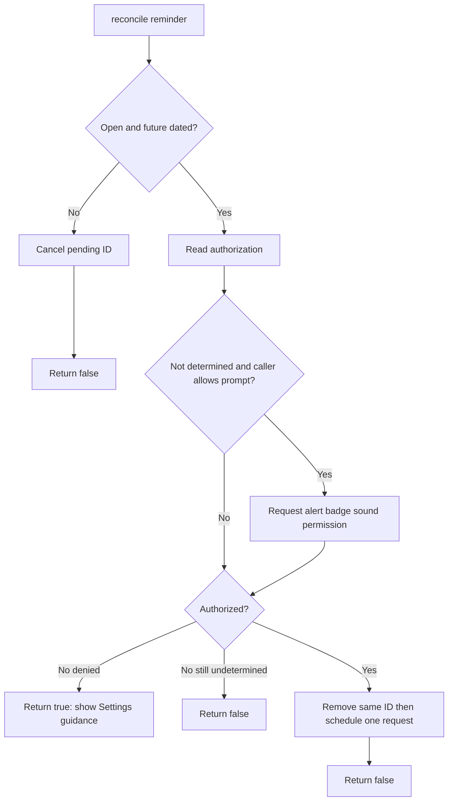

### Important implementation observation

The current scheduling policy does not inspect `archivedAt`. Therefore archiving a still-open, future-dated reminder does not itself disqualify the notification. This guide describes the implementation; it does not silently reinterpret it.

---

# 9. Shared reminder UI components

## 9.1 [`TimeLore/Features/Reminders/ReminderTagPresentation.swift`](../TimeLore/Features/Reminders/ReminderTagPresentation.swift)

### Purpose

Maps tag names to stable visual colors and SF Symbols without using color as tag identity.

| Lines | Explanation | UI effect |
|---:|---|---|
| 1 | Imports SwiftUI for `Color`. | Presentation-only type. |
| 3 | Declares value type. | Returned for each tag. |
| 4 | Stores semantic color. | Chip foreground/background tint. |
| 5 | Stores SF Symbol name. | Chip icon. |
| 7 | Declares name-to-presentation factory. | Callers do not duplicate switch logic. |
| 8 | Normalizes the incoming name before switching. | Default recognition is case/whitespace-insensitive. |
| 9 | Work maps to blue briefcase. | Work chip. |
| 10 | Personal maps to purple person. | Personal chip. |
| 11 | Projects maps to indigo folder. | Projects chip. |
| 12 | Grocery maps to green cart. | Grocery chip. |
| 13 | Health maps to pink heart. | Health chip. |
| 14 | Errands maps to teal checklist. | Errands chip. |
| 15 | Starts custom-tag fallback. | Unknown tags still receive stable styling. |
| 16 | Defines four color/symbol tuples. | User tags choose cyan, mint, orange, or brown with tag symbol. |
| 17 | Reduces Unicode scalar values into a valid palette index. | Same spelling deterministically selects same palette slot. |
| 18 | Returns tuple components as a presentation. | Chip uses selected styling. |
| 19–21 | Close switch, function, and type. | None. |

## 9.2 [`TimeLore/Features/Reminders/ReminderTagChip.swift`](../TimeLore/Features/Reminders/ReminderTagChip.swift)

### Purpose

Renders the reusable capsule used by filters, list tags, detail tags, and editor selections.

| Lines | Explanation | UI effect |
|---:|---|---|
| 1 | Imports SwiftUI. | Enables `View`, `Label`, `Color`, and modifiers. |
| 3 | Declares a SwiftUI view. | Reusable chip component. |
| 4 | Required visible name. | Text label. |
| 5 | Selection defaults false. | Most display-only chips are unselected. |
| 6 | Optional symbol override. | All/Important/Untagged can choose specific icons. |
| 7 | Optional tint override. | Filter chips can override tag palette. |
| 9–11 | Computes normal presentation from the tag name. | Default tag color/icon. |
| 13–15 | Uses explicit tint or default presentation color. | One source for subsequent foreground/background. |
| 17 | Declares view body. | SwiftUI rendering begins. |
| 18 | Creates a text-and-symbol `Label`, preferring explicit symbol. | Chip always has visible text and an icon. |
| 19 | Caption font; semibold selected, medium otherwise. | Selection has non-color emphasis. |
| 20–21 | Adds horizontal and vertical padding. | Enlarges capsule around content. |
| 22 | Selected text is white; unselected text uses semantic tint. | High-contrast selected state. |
| 23 | Selected uses solid tint; unselected uses 14% tint. | Visual selected/unselected difference. |
| 24 | Clips final background to capsule. | Rounded pill geometry. |
| 25–26 | Close body and view. | None. |

### SwiftUI modifier order

Modifiers wrap the view in order. Padding occurs before background, so the background includes padded space. Clipping occurs after background, so the colored rectangle becomes a capsule.

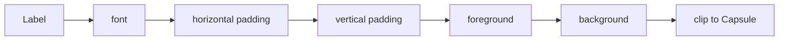

---

# 10. Reminder Home

## [`TimeLore/Features/Reminders/ReminderListView.swift`](../TimeLore/Features/Reminders/ReminderListView.swift)

### Purpose

This is the root screen. It observes stored reminders and tags, computes search/filter/sort results, displays empty or sectioned content, presents creation, navigates to detail, and implements swipe/lifecycle actions.

## 10.1 Dependencies and state, lines 1–17

| Lines | Explanation | UI/runtime meaning |
|---:|---|---|
| 1–2 | Import SwiftData and SwiftUI. | Persistence queries plus view construction. |
| 4 | Declares root view. | Reminder Home screen. |
| 5 | Reads current light/dark appearance. | Selects white or OLED-black content background. |
| 6 | Reads shared notification service. | Lifecycle actions can cancel/reschedule requests. |
| 7 | Reactive query for all reminders. | Inserts/edits/deletes automatically refresh computed lists. |
| 8 | Reactive tag query sorted by name. | Filter rail updates when tags are created. |
| 10 | UserDefaults-backed Open expansion, default true. | Open starts expanded and remembers user choice. |
| 11 | Completed expansion, default false. | Completed starts collapsed. |
| 12 | Archived expansion, default false. | Archived starts collapsed. |
| 14 | Sheet-presentation state. | Plus/empty action shows editor. |
| 15 | Search text state. | Bound to native search field. |
| 16 | Selected top-level filter. | Exactly one filter choice at a time. |
| 17 | Persisted sort raw value, default due date. | Sort choice survives relaunch. |

## 10.2 Derived collections, lines 19–54

| Lines | Property/function | Detailed rule |
|---:|---|---|
| 19–21 | `filteredReminders` | Applies search first and tag filter second. The operations are logically ANDed. |
| 23–26 | `openReminders` | Selects unarchived/open records, then sorts using priority or default due order. |
| 28–30 | `completedReminders` | Selects unarchived/completed records and sorts by newest completion. |
| 32–34 | `archivedReminders` | Selects every archived record regardless of open/completed status, sorted newest archive first. |
| 36–44 | `orderedTags` | Compares product default rank first; equal ranks use localized case-insensitive alphabetical name. User tags have max rank and come after defaults. |
| 46–50 | `defaultTagRank` | Searches the six required defaults by normalized identity; returns index or `.max`. |
| 52–54 | `sortMode` | Converts persisted raw string back into enum; falls back to due date if unknown. |

### Filtering pipeline

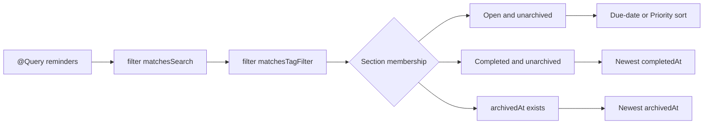

## 10.3 Main view hierarchy, lines 56–127

| Lines | Explanation | Visible result |
|---:|---|---|
| 56 | Declares body. | SwiftUI reevaluates when observed state changes. |
| 57 | Starts `NavigationStack`. | Supports push navigation to detail. |
| 58 | Starts `List`. | Provides scrolling rows/sections and swipe behavior. |
| 59 | Inserts filter rail. | All/Important/Untagged/tag chips at top. |
| 61 | Checks whether database has zero reminders. | Distinguishes truly empty from filtered empty. |
| 62–68 | Builds `ContentUnavailableView` with lightbulb, product message, explanation, and New reminder action. | First-run empty state. |
| 69 | Clear row background. | Empty state blends with content layer. |
| 70 | Else-if checks whether filtering removed all results. | Search/filter-specific empty path. |
| 71–77 | Builds magnifying-glass empty state with Clear filters action. | “No reminders found.” |
| 78 | Clear background. | Matches page. |
| 79 | Else begins sectioned result UI. | At least one filtered reminder exists. |
| 80–82 | Builds Open disclosure, count, persistent binding, and rows/empty message. | Open section. |
| 83–85 | Builds Completed disclosure. | Completed section. |
| 86–88 | Builds Archived disclosure. | Archived section. |
| 89–90 | Close conditional and list content. | None. |
| 91 | Plain list style. | Avoids grouped-card appearance. |
| 92 | Hides standard scroll content background. | Allows explicit white/black layer. |
| 93 | Uses black in dark mode, white otherwise. | OLED-dark/pure-white content. |
| 94 | Navigation title uses bundle-derived app name. | Large “TimeLore” title. |
| 95 | Adds native searchable UI bound to search text. | Search field/presentation. |
| 96 | Starts toolbar. | Adds sort and create actions. |
| 97 | Primary-action toolbar item for sort. | System positions action appropriately. |
| 98 | Starts sort menu. | Tapping icon reveals choices. |
| 99–103 | Due-date button writes raw value; label shows checkmark when active, calendar otherwise. | Select Due date. |
| 104–108 | Priority button writes raw value; label shows checkmark when active, priority symbol otherwise. | Select Priority. |
| 109–113 | Menu label is sort icon with semibold font and 44×44 frame. | Accessible touch target. |
| 114–116 | Accessibility purpose, current value, and test identifier. | VoiceOver/UI tests can identify sort control. |
| 117 | Closes first toolbar item. | None. |
| 118 | Starts second primary action. | Create control. |
| 119 | Plus button toggles sheet state. | Opens New Reminder. |
| 120 | Accessibility hint describes optional fields. | VoiceOver explanation. |
| 121–122 | Close toolbar item and toolbar. | None. |
| 123 | Sheet observes Boolean binding. | Presentation follows state. |
| 124 | Creates nested navigation stack containing blank editor. | Sheet receives its own title and toolbar. |
| 125–127 | Close sheet, root navigation, and body. | None. |

## 10.4 Filter rail, lines 129–154

| Lines | Explanation | UI result |
|---:|---|---|
| 129 | Declares computed subview. | Keeps main body readable. |
| 130 | Horizontal scroll without indicator. | Chips can extend beyond phone width. |
| 131 | Horizontal stack with 8-point spacing. | Consistent chip rhythm. |
| 132 | All chip with neutral tray symbol. | Removes top-level filter. |
| 133 | Important chip with orange filled flag. | Filters `isImportant == true`. |
| 134 | Untagged chip with tag-slash. | Filters reminders with zero tags. |
| 135–137 | Iterates ordered tags and creates a `.tag(normalizedName)` filter. | One chip per stored tag. |
| 139–140 | Horizontal and small vertical padding. | Comfortable placement and edge breathing room. |
| 142 | Clear list-row background. | Filter rail does not look like content card. |
| 143 | Custom row insets remove list side inset while retaining small vertical inset. | Scroll rail reaches screen edges. |
| 144 | Accessibility label for the rail. | VoiceOver context. |
| 145 | Closes subview. | None. |
| 147 | Declares reusable filter-button builder with optional symbol/tint. | Avoids duplicate code. |
| 148 | Button assigns selected filter. | State change recomputes collections. |
| 149 | Chip selection compares current and candidate filters. | Selected styling changes immediately. |
| 151 | Plain button style. | Preserves custom capsule appearance. |
| 152–153 | Accessibility label/value. | Announces “Selected” or “Not selected.” |
| 154 | Closes helper. | None. |

## 10.5 Rows and swipe actions, lines 156–206

| Lines | Explanation | Interaction |
|---:|---|---|
| 156 | `@ViewBuilder` allows conditional branches to produce views. | Helper can return empty message or multiple rows. |
| 157 | Function accepts reminder array and empty copy. | Reused by all disclosures. |
| 158–162 | Empty array renders secondary subheadline with test identifier. | Expanded section communicates its own emptiness. |
| 163 | Else begins rows. | Nonempty collection. |
| 164 | `ForEach` uses SwiftData model identity. | One row per reminder. |
| 165–167 | Creates `ReminderListItem` and supplies completion closure. | Completion circle acts through parent logic. |
| 168 | Leading swipe allows full swipe. In left-to-right layout, user swipes right. | Complete/Reopen progress gesture. |
| 169 | Archived reminders do not get progress swipe. | Must restore before direct status change. |
| 170 | Closes leading actions. | None. |
| 171 | Trailing swipe disables full swipe. User swipes left. | Organization actions require explicit choice. |
| 172 | Adds archive/restore and flag/unflag. | Required organization gesture. |
| 173–176 | Close swipe modifiers, loop, branch, and helper. | None. |
| 178–179 | View-builder helper for progress action. | Produces one action based on status. |
| 180 | Checks completed state. | Chooses Reopen versus Complete. |
| 181–184 | Reopen action mutates domain then reconciles notification. | Returns reminder to Open and may reschedule a future due notification. |
| 185 | Blue tint. | Semantic reopen color. |
| 186 | Else open path. | Complete action. |
| 187–190 | Complete action mutates domain then reconciles. | Moves to Completed and cancels notification. |
| 191 | Green tint. | Semantic completion color. |
| 192–193 | Close conditional/helper. | None. |
| 195–196 | View-builder helper for organization actions. | Shared by archived and unarchived. |
| 197–199 | Dynamic Archive/Restore button and lifecycle mutation. | Moves between Archived and original status section. |
| 200 | Orange archive or blue restore tint. | Distinguishes action. |
| 202–204 | Dynamic Flag/Unflag button toggles Important through domain method. | Updates flag and Important filter. |
| 205 | Orange tint. | Important semantic color. |
| 206 | Closes helper. | None. |

### Swipe contract

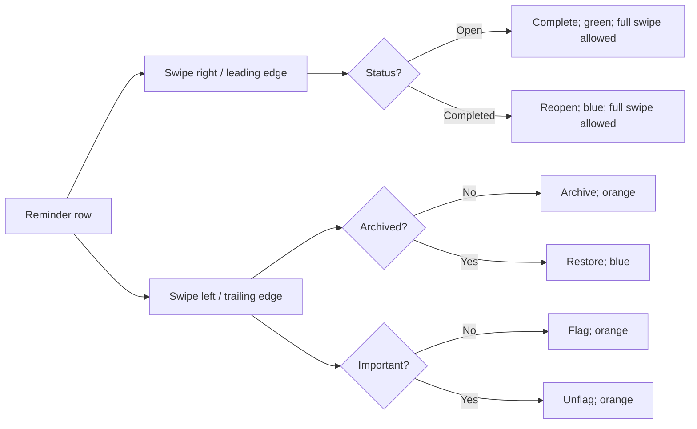

## 10.6 Search, filters, and helpers, lines 208–256

| Lines | Explanation |
|---:|---|
| 208 | Declares per-reminder search predicate. |
| 209 | Trims search query boundaries. |
| 210 | Empty query matches every reminder. |
| 211 | Case-insensitive title OR Notes matching. |
| 212 | Closes predicate. |
| 214 | Declares top-level filter predicate. |
| 215 | Switches on enum state. |
| 216 | All returns true. |
| 217 | Important returns reminder flag. |
| 218 | Untagged requires empty relationship collection. |
| 219 | Specific tag checks normalized identity in relationships. |
| 220–221 | Close switch and function. |
| 223–226 | Clear helper empties search and selects All. |
| 228–230 | Starts asynchronous notification reconciliation without permission prompting. |
| 232–239 | Completion-circle helper chooses reopen/complete and then reconciles. |
| 240 | Closes main view. |
| 242–247 | Private `TagFilter` enum models All, Important, Untagged, or tag identity. `Equatable` enables selection comparison. |
| 249–252 | Private raw-string sort enum provides Due date and Priority options. |
| 253–255 | Accessibility property converts internal choice to spoken text. |
| 256 | Closes sort enum. |

## 10.7 Disclosure and row subviews, lines 258–380

### `ReminderDisclosureSection`, lines 258–283

| Lines | Explanation | UI effect |
|---:|---|---|
| 258 | Generic view where caller chooses child content type. | Reusable section wrapper. |
| 259–261 | Stores identifier, title, and count. | Test identity and visible header. |
| 262 | `@Binding` borrows expansion state owned by parent. | Tapping writes into `@AppStorage`. |
| 263 | `@ViewBuilder` content closure. | Caller supplies rows. |
| 265 | Body begins. | Section rendering. |
| 266 | `DisclosureGroup` binds expansion. | Native expand/collapse interaction. |
| 267 | Calls content closure only in disclosure content position. | Rows shown when expanded. |
| 268 | Starts custom label. | Header. |
| 269 | Horizontal stack. | Title and count arrangement. |
| 270 | Headline title. | “Open,” “Completed,” or “Archived.” |
| 271 | Spacer pushes count trailing. | Alignment. |
| 272–274 | Formats count with monospaced digits and secondary style. | Count changes without glyph-width jitter. |
| 276 | Rectangular content shape. | Full label area is tappable. |
| 277 | Combines accessibility children. | Predictable VoiceOver element. |
| 278 | Announces title and count. | “Open, 3 reminders.” |
| 279 | Dynamic collapse/expand hint. | Describes next action. |
| 280–281 | Close label and set UI-test identifier. | Tests find section button. |
| 282–283 | Close body and component. | None. |

### `ReminderListItem`, lines 285–320

| Lines | Explanation | UI effect |
|---:|---|---|
| 285 | Private row view. | Encapsulates status control plus navigation. |
| 286 | Live reminder reference. | Reads current model state. |
| 287 | Closure supplied by parent. | Parent owns completion and notification policy. |
| 289 | Body begins. | Row rendering. |
| 290 | Top-aligned HStack with 12 spacing. | Status column beside content. |
| 291 | Checks unarchived state. | Archived status icon is noninteractive. |
| 292 | Completion button invokes supplied closure. | Completes/reopens without navigation. |
| 293 | Selects filled checkmark or circle SF Symbol. | Visible status. |
| 294 | Green completed, secondary open color. | Semantic status color. |
| 295 | Title-2 icon size. | Legibility. |
| 296 | 44×44 frame. | Minimum touch target. |
| 298 | Borderless button style inside List. | Prevents entire row-style button behavior. |
| 299 | Dynamic reminder-specific accessibility label. | VoiceOver names action and reminder. |
| 300 | Accessibility hint. | Explains state change. |
| 301 | Stable identifier. | UI automation finds completion control. |
| 302 | Else archived path. | Noninteractive visual status. |
| 303–306 | Repeats icon appearance without Button. | Archived reminder still displays completion status. |
| 307 | Hides duplicated decorative icon from accessibility. | Row summary already announces status. |
| 308 | Closes condition. | None. |
| 310 | NavigationLink destination is detail for same reminder. | Tapping content pushes detail. |
| 311 | Label is `ReminderRowContent`. | Displays summary. |
| 313 | Ignores child accessibility. | Avoids fragmented reading. |
| 314 | Supplies composed summary. | VoiceOver reads predictable order. |
| 315 | Dynamic navigation and swipe hint. | Explains available gestures. |
| 316 | UUID-based identifier. | Each row can be uniquely addressed. |
| 317–319 | Close HStack, add vertical padding, close body. | Row spacing. |
| 320 | Close component. | None. |

### `ReminderRowContent`, lines 322–380

| Lines | Explanation | UI effect |
|---:|---|---|
| 322–323 | Declares content view and reminder input. | Summary presentation. |
| 325–327 | Alphabetically sorts tags. | Stable visual/accessibility order. |
| 329–331 | Overdue means open with due date before now; missing date uses distant future. | Red due treatment only when appropriate. |
| 333 | Declares accessibility summary. | Replaces child-by-child reading. |
| 334 | Starts with status and title. | Essential information first. |
| 335 | Appends Important when true. | Flag is not color-only. |
| 336 | Appends spoken priority when non-none. | Punctuation has language. |
| 337 | Appends Notes when present. | Context is discoverable. |
| 338–341 | Appends Due/Overdue and localized formatted date when present. | Date state is spoken. |
| 342 | Appends comma-separated tag names. | Tag colors are not required. |
| 343 | Joins all parts with commas. | One predictable VoiceOver phrase. |
| 344 | Closes property. | None. |
| 346 | Body begins. | Visible content. |
| 347 | Leading VStack with 6 spacing. | Vertical summary layout. |
| 348 | First-baseline HStack. | Flag, priority, and title align typographically. |
| 349–351 | Optional orange filled flag, hidden from accessibility. | Visual Important state. |
| 352–357 | Optional bold red punctuation marker, hidden from accessibility. | Visual priority state. |
| 358 | Headline title limited to two lines. | Primary row content. |
| 359 | Closes title HStack. | None. |
| 360–362 | Optional secondary Notes preview limited to two lines. | Context preview. |
| 363–367 | Optional calendar label formatted with abbreviated month/day/time; overdue red, otherwise secondary. | Due summary. |
| 368 | Checks for tags. | Omits empty chip area. |
| 369 | Horizontal scroll without indicator. | Long tags do not force row width. |
| 370 | Tag stack with 6 spacing. | Compact chips. |
| 371 | Displays first three sorted tags. | Limits row density. |
| 372–374 | Displays `+N` when more than three. | Communicates hidden count. |
| 375–377 | Close tag stack, scroll, and condition. | None. |
| 378–380 | Close VStack, body, and component. | None. |

## 10.8 Preview, lines 382–386

| Lines | Explanation |
|---:|---|
| 382 | Declares named Xcode preview. |
| 383 | Renders the root view. |
| 384 | Injects notification service required by `@EnvironmentObject`. |
| 385 | Injects in-memory SwiftData schemas. |
| 386 | Closes preview. |

---

# 11. New and Edit Reminder

## [`TimeLore/Features/Reminders/ReminderEditorView.swift`](../TimeLore/Features/Reminders/ReminderEditorView.swift)

### Purpose

The same screen handles creation and editing. It keeps unsaved values in local state, validates them through `ReminderDraft`, resolves tag relationships, inserts or updates SwiftData models, reconciles notifications, and handles denied-permission guidance.

## 11.1 Dependencies and form state, lines 1–38

| Lines | Explanation | UI/runtime meaning |
|---:|---|---|
| 1–2 | Import SwiftData and SwiftUI. | Persistence plus form UI. |
| 4 | Declares editor view. | New/Edit Reminder sheet content. |
| 5 | Dismiss environment action. | Cancel/save can close sheet. |
| 6 | SwiftData model context. | Inserts models and tracks mutations. |
| 7 | URL-opening environment action. | Opens iOS Settings after denied permission. |
| 8 | Shared notification service. | Schedules/cancels after save. |
| 9 | Reactive sorted tag query. | Displays available tags. |
| 11 | Optional reminder determines create versus edit. | `nil` means New; value means Edit. |
| 12 | Captures original due date. | Validation can permit unchanged overdue date. |
| 14 | Local title state. | Bound to title field. |
| 15 | Local Notes state. | Bound to Notes field. |
| 16 | Local due-toggle state. | Controls date picker visibility and whether draft due date is nil. |
| 17 | Local date value. | Bound to date picker even when hidden. |
| 18 | Local Important state. | Bound to flag toggle. |
| 19 | Local priority state. | Bound to segmented picker. |
| 20 | Set of selected normalized tag identities. | Prevents duplicate selections. |
| 21 | Dictionary of normalized identity to display name for unsaved new tags. | Cancel can discard them. |
| 22 | New-tag text field state. | User input. |
| 23–24 | Reminder/tag validation messages. | Separate inline error surfaces. |
| 25 | Notification guidance alert state. | Presents denied message after save. |
| 26 | UserDefaults flag remembers whether contextual prompt was initiated. | Avoids repeatedly prompting. |
| 28 | Custom initializer accepts optional reminder. | Configures creation/editing. |
| 29 | Stores optional reference. | Later save branches on it. |
| 30 | Stores original due date. | Editing validation context. |
| 31–37 | Initializes property-wrapper storage with existing values or creation defaults. The underscore accesses each `State` wrapper itself. | Edit is prefilled; New is blank, due time defaults one hour ahead, flag off, priority none. |
| 38 | Closes initializer. | None. |

## 11.2 Computed draft and tag options, lines 40–58

| Lines | Explanation |
|---:|---|
| 40 | Declares computed draft. |
| 41 | Constructs value from current fields; due date becomes nil when toggle is off. |
| 42 | Closes draft property. |
| 44 | Declares merged tag option list. |
| 45–49 | Creates dictionary from fetched tags keyed by normalized identity. `uniqueKeysWithValues` assumes fetched normalized names are unique, matching SwiftData constraint. |
| 51–53 | Overlays pending tags into same dictionary. |
| 55–57 | Returns values sorted case-insensitively by display name. |
| 58 | Closes property. |

## 11.3 Form UI, lines 60–172

| Lines | Explanation | Visible result |
|---:|---|---|
| 60 | Body begins. | Editor rendering. |
| 61 | Starts native `Form`. | System form styling and scrolling. |
| 62 | Reminder section. | Groups text fields. |
| 63 | Multiline-axis title `TextField` bound to title. | “What do you need to do?” |
| 64 | Sentence capitalization. | Keyboard behavior. |
| 65 | Allows one to three lines. | Expands for longer title. |
| 66–67 | Accessibility label and UI-test identifier. | VoiceOver and automation identity. |
| 69 | Multiline-axis Notes field. | Optional context input. |
| 70 | Sentence capitalization. | Keyboard behavior. |
| 71 | Allows three to eight lines. | Notes is visually prominent. |
| 72–73 | Accessibility/test identity. | Reliable spoken/automated selection. |
| 74 | Closes section. | None. |
| 76 | When section. | Due-date controls. |
| 77 | Animated binding to due toggle. | Date picker insertion/removal animates. |
| 79 | Conditional due UI. | Picker absent when due disabled. |
| 80–84 | DatePicker bound to due date with date and time components. | User selects exact due moment. |
| 85–86 | Close conditional/section. | None. |
| 88 | Priority & Flag section. | Related but independent controls. |
| 89–90 | Important toggle and identifier. | Explicit flag selection. |
| 92 | Priority picker bound to enum. | Segmented options. |
| 93 | Iterates `allCases`. | None/!/!!/!!! generated from enum. |
| 94 | Displays None or marker and tags each view with enum option. | SwiftUI maps selected segment to enum value. |
| 95–96 | Close loop/picker. | None. |
| 97 | Segmented style. | Horizontal native control. |
| 98–99 | Accessibility label and expanded current value. | Punctuation becomes understandable speech. |
| 100 | Closes section. | None. |
| 102 | Tags section. | Selection and creation. |
| 103 | Only shows option rail if options exist. | Avoids empty scroll container. |
| 104 | Horizontal scroll. | Many tags remain usable. |
| 105 | HStack with 8 spacing. | Tag chips. |
| 106 | Iterates merged options. | Existing and pending tags displayed alike. |
| 107–109 | Button calls toggle helper. | Select/deselect. |
| 110–113 | Renders tag chip using Set membership for selected state. | Visual selection updates. |
| 115 | Plain button style. | Keeps custom chip styling. |
| 116–117 | Accessibility label and selected/not-selected value. | Color is not sole indicator. |
| 118–121 | Close button/loop/stack, add slight vertical padding, close scroll. | Layout. |
| 122 | Close options condition. | None. |
| 124 | HStack for new-tag field and Add. | Inline creation row. |
| 125 | Text field bound to raw new name. | User input. |
| 126 | Word capitalization. | Tag-style keyboard behavior. |
| 127 | Done submit label. | Keyboard return key. |
| 128 | Submitting calls `addTag`. | Keyboard path equals button path. |
| 129 | UI-test identifier. | Automation. |
| 131 | Add button calls same helper. | Explicit action. |
| 132 | Disabled when trimmed input is empty. | Prevents obvious blank submission. |
| 133 | Closes HStack. | None. |
| 135 | Optional-binds tag error. | Error row only exists when needed. |
| 136–138 | Caption red error text. | Inline validation feedback. |
| 139–140 | Close condition/Tags section. | None. |
| 142 | Optional-binds reminder validation error. | Separate validation area. |
| 143 | Starts section. | Gives error form spacing. |
| 144–146 | Red text marked static for accessibility. | User sees/hears validation. |
| 147–149 | Close section, condition, and Form. | None. |
| 150 | Dynamic New/Edit navigation title. | Communicates mode. |
| 151 | Inline title style. | Sheet navigation appearance. |
| 152 | Toolbar begins. | Cancel and Save. |
| 153 | Cancellation placement. | Native location. |
| 154 | Cancel dismisses without calling save. | Local `@State` and pending tags are discarded. |
| 155 | Close item. | None. |
| 157 | Confirmation placement. | Native Save location. |
| 158 | Save button invokes `save`. | Starts validation/persistence. |
| 159–160 | Hint and test identifier. | Accessibility/automation. |
| 161–162 | Close item/toolbar. | None. |
| 163 | Alert bound to guidance Boolean. | Appears after denied reconciliation. |
| 164 | Open Settings button. | Recovery action. |
| 165 | Creates and opens Apple settings URL; force unwrap assumes system constant is valid. | Leaves app for Settings. |
| 166 | Dismisses editor. | Reminder was already saved. |
| 168 | Continue dismisses. | User stays with notifications off. |
| 169 | Starts alert message. | Explanation. |
| 170 | States reminder saved but cannot notify until enabled. | Denial does not imply data loss. |
| 171–172 | Close alert/body. | None. |

## 11.4 Tag helpers and save, lines 174–250

### `toggleTag`, lines 174–180

| Lines | Explanation |
|---:|---|
| 174 | Accepts normalized identity. |
| 175 | Checks Set membership. |
| 176 | Removes selected identity. |
| 177 | Else unselected. |
| 178 | Inserts identity. |
| 179–180 | Close condition/function. |

### `addTag`, lines 182–198

| Lines | Explanation | Result |
|---:|---|---|
| 182 | Begins helper. | No database mutation yet. |
| 183 | Validates raw field. | Uses central model rule. |
| 184 | Stores error. | Inline message appears. |
| 185 | Returns immediately. | Invalid tag is not selected. |
| 186 | Closes validation condition. | None. |
| 188 | Calculates trimmed display spelling. | User-facing name. |
| 189 | Calculates stable normalized identity. | Matching key. |
| 190 | Selects identity automatically. | Newly added tag chip is selected. |
| 192 | Checks database options for same normalized identity. | Reuses existing tag if equivalent. |
| 193 | Stores new tag in pending dictionary only when absent. | Cancel remains non-destructive. |
| 194 | Closes check. | None. |
| 196 | Clears input field. | Ready for another tag. |
| 197 | Clears validation message. | Removes old error. |
| 198 | Closes helper. | None. |

### `save`, lines 200–244

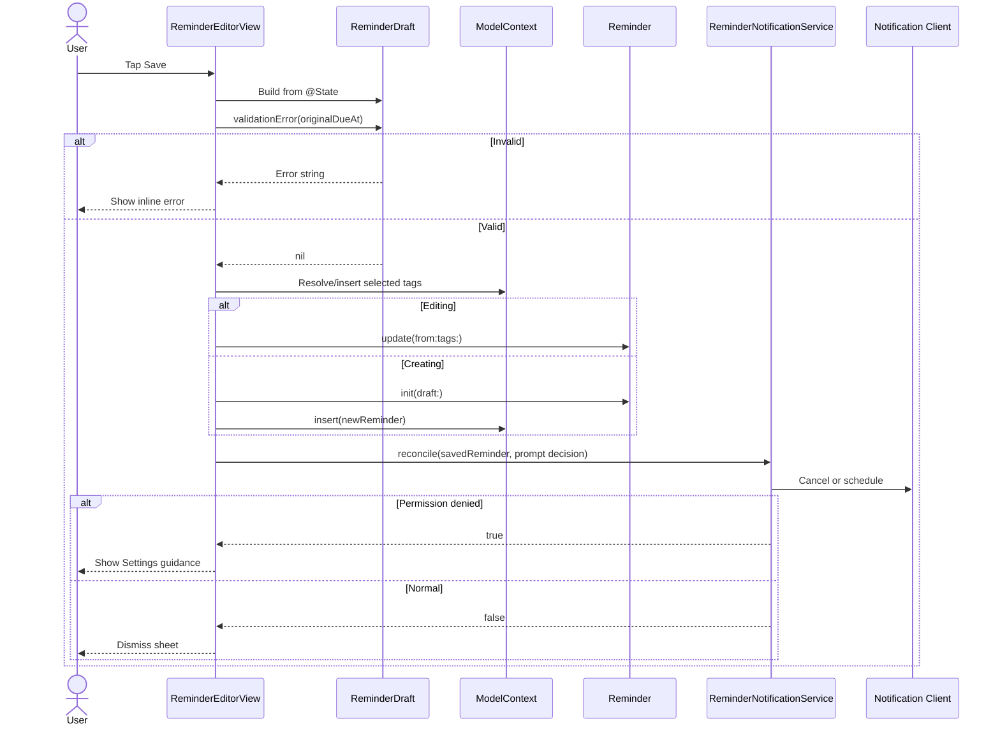

| Lines | Explanation |
|---:|---|
| 200 | Begins save workflow. |
| 201 | Validates draft while allowing unchanged original due date during edit. |
| 202 | Stores returned error. |
| 203 | Stops invalid save. |
| 204 | Closes validation condition. |
| 206 | Converts selected normalized identities into actual `ReminderTag` objects with `compactMap`. |
| 207 | Searches fetched existing tags. |
| 208 | Returns existing managed object when found. |
| 209 | Closes existing path. |
| 211 | Requires pending display name; otherwise drops inconsistent identity with `nil`. |
| 212 | Creates new tag object. |
| 213 | Inserts new tag into model context. |
| 214 | Returns new tag into resolved array. |
| 215 | Closes compact map. |
| 217 | Declares one saved-reminder reference for both branches. |
| 218 | Optional binding checks edit mode. |
| 219 | Applies domain update with resolved tags. |
| 220 | Uses existing reminder as result. |
| 221 | Else create mode. |
| 222 | Initializes new reminder from validated draft. |
| 223 | Assigns resolved relationship objects. |
| 224 | Inserts reminder. |
| 225 | Uses new object as result. |
| 226 | Closes create/edit branch. |
| 228 | Prompt only if reminder qualifies for scheduling and prompt flag is false. |
| 229 | Checks prompt decision. |
| 230 | Marks prompted before async operation to prevent repeated initiation. |
| 231 | Closes condition. |
| 233 | Starts async task. |
| 234–237 | Awaits reconciliation with computed prompt permission. |
| 238 | Checks service guidance result. |
| 239 | Presents alert when denied. |
| 240 | Else normal path. |
| 241 | Dismisses editor. |
| 242–244 | Close condition, task, and save function. |

There is no explicit `modelContext.save()` here. The shared SwiftData main context is expected to autosave inserted and mutated models.

## 11.5 `TagOption` and preview, lines 247–257

| Lines | Explanation |
|---:|---|
| 247 | Private presentation-only identifiable struct. |
| 248 | Normalized string serves as stable `id`. |
| 249 | Stores display name. |
| 250 | Closes type. |
| 252 | Declares preview. |
| 253–255 | Wraps blank editor in navigation stack. |
| 256 | Supplies in-memory model container. |
| 257 | Closes preview. |

The editor requires a `ReminderNotificationService` environment object but this preview does not inject one explicitly. Adding the same environment injection used by the list preview would make the dependency fully self-contained.

---

# 12. Reminder Detail

## [`TimeLore/Features/Reminders/ReminderDetailView.swift`](../TimeLore/Features/Reminders/ReminderDetailView.swift)

### Purpose

Displays a live reminder, exposes lifecycle and editing controls, shows history, reconciles notifications, and performs confirmed deletion.

## 12.1 Dependencies and state, lines 1–17

| Lines | Explanation |
|---:|---|
| 1–2 | Import SwiftData and SwiftUI. |
| 4 | Declares detail view. |
| 5 | Dismiss action returns to Home after deletion. |
| 6 | Model context performs deletion. |
| 7 | Color scheme chooses content background. |
| 8 | Shared notification service. |
| 10 | Live reminder reference. |
| 12 | Edit-sheet state. |
| 13 | Delete-alert state. |
| 15–17 | Alphabetically sorts related tags for presentation. |

## 12.2 Detail list, lines 19–93

| Lines | Explanation | Visible result |
|---:|---|---|
| 19 | Body begins. | Detail rendering. |
| 20 | Starts List. | Scrollable native sections. |
| 21–23 | First section contains identity card. | Full reminder title card. |
| 24 | Clear row background. | Card supplies its own surface. |
| 25 | Custom insets. | Card spacing. |
| 27 | NOTES section. | Context area. |
| 28 | Checks empty Notes. | Empty-state path. |
| 29 | Secondary “No notes added.” | Explicit absence. |
| 30 | Else Notes exist. |
| 31 | Full Notes text. | Context preserved. |
| 32–33 | Close condition/section. | None. |
| 35 | Optional-binds due date. | Omits entire Due section when nil. |
| 36 | Due section. | Date information. |
| 37–39 | Calendar label with weekday, wide month, day, year, hour, and minute. | Localized due row. |
| 40–41 | Close section/condition. | None. |
| 43 | Priority & Flag section. | Independent controls. |
| 44 | Toggle receives custom Binding. | Direct model-backed control. |
| 45 | Binding getter reads `isImportant`. | UI reflects live object. |
| 46 | Binding setter calls domain mutation. | Preserves lifecycle invariants. |
| 47 | Starts toggle label. | Custom label. |
| 48 | Label uses filled flag. | Explicit Important wording/symbol. |
| 49 | Orange foreground. | Semantic accent. |
| 50 | Closes label. | None. |
| 51 | UI-test identifier. | Automation. |
| 53 | Priority picker gets custom Binding. | Direct model-backed priority. |
| 54 | Getter reads enum wrapper. | Current segment. |
| 55 | Setter calls domain method. | Updates timestamp safely. |
| 56 | Starts picker options. | None/!/!!/!!!. |
| 57–59 | Iterates cases and tags each text view with enum. | Selection mapping. |
| 60 | Closes picker. | None. |
| 61 | Segmented style. | Native horizontal control. |
| 62 | Expanded accessibility value. | Understandable priority speech. |
| 63 | Closes section. | None. |
| 65 | Checks for tags. | Omits empty section. |
| 66 | Tags section. | Related categories. |
| 67 | Horizontal scroll. | Handles width. |
| 68 | HStack. | Chip row. |
| 69 | Iterates sorted tags into chips. | Stable order. |
| 70–73 | Close stack/scroll/section/condition. | None. |
| 75 | History section. | Audit timestamps. |
| 76 | Created labeled content. | Creation date/time. |
| 77 | Updated labeled content. | Last change. |
| 78–80 | Optional Completed row. | Completion history when present. |
| 81–83 | Optional Archived row. | Archive history when present. |
| 84 | Closes History. | None. |
| 86 | Final action section. | Status action. |
| 87 | Dynamic Reopen/Mark as completed label. | Reflects status. |
| 88 | Calls correct lifecycle function. | Mutates model. |
| 89 | Reconciles pending notification. | Completion cancels; future reopen may reschedule. |
| 90 | Closes action. | None. |
| 91 | UI-test identifier. | Automation. |
| 92–93 | Close action section/List. | None. |

## 12.3 Styling, toolbar, sheets, and alerts, lines 94–125

| Lines | Explanation | UI result |
|---:|---|---|
| 94 | Hides standard list content background. | Allows explicit layer. |
| 95 | Pure black/white background. | OLED/light parity. |
| 96 | Navigation title “Reminder.” | Screen identity. |
| 97 | Inline title mode. | Compact detail navigation. |
| 98 | Toolbar begins. | Overflow actions. |
| 99 | Primary action item. | System placement. |
| 100 | Menu begins. | Ellipsis menu. |
| 101 | Edit sets sheet state true. | Presents editor. |
| 102–104 | Dynamic Mark Important/Unflag action and symbol; toggles through domain method. | Updates flag. |
| 105–107 | Dynamic Archive/Restore action and symbol; applies lifecycle method. | Moves section membership without changing status. |
| 108 | Divider separates destructive action. | Visual hierarchy. |
| 109 | Destructive Delete only sets confirmation state. | No immediate data loss. |
| 110 | Starts menu label. | Overflow trigger. |
| 111 | Ellipsis-circle label. | “More actions.” |
| 112 | Closes label. | None. |
| 113 | UI-test identifier. | Automation. |
| 114–115 | Close toolbar item/toolbar. | None. |
| 116 | Sheet observes edit state. | Edit presentation. |
| 117 | Nested navigation stack uses existing reminder. | Prefilled Edit Reminder. |
| 118 | Closes sheet. | None. |
| 119 | Alert observes deletion state and uses required title. | Confirmation. |
| 120 | Cancel role dismisses alert automatically. | No deletion. |
| 121 | Destructive Delete calls function. | Confirmed deletion. |
| 122 | Starts message. | None. |
| 123 | Required irreversible-action copy. | Warns user. |
| 124–125 | Close alert/body. | None. |

## 12.4 Notification and deletion functions, lines 127–138

| Lines | Explanation |
|---:|---|
| 127 | Begins reconcile helper. |
| 128 | Starts Task, awaits service without prompting, ignores Boolean response. |
| 129 | Closes helper. |
| 131 | Begins delete helper. |
| 132 | Starts asynchronous Task. |
| 133 | Cancels notification before losing reminder identity. |
| 134 | Deletes reminder from model context. |
| 135 | Dismisses detail. |
| 136–138 | Close Task, function, and main view. |

## 12.5 Identity card, lines 140–157

| Lines | Explanation | UI effect |
|---:|---|---|
| 140 | Private small subview. | Detail title card. |
| 141 | Reminder input. | Reads title. |
| 143 | Body begins. | Rendering. |
| 144 | Leading VStack with 6 spacing. | Vertical hierarchy. |
| 145 | “REMINDER” eyebrow text. | Content type label. |
| 146 | Semibold caption. | Secondary hierarchy. |
| 147 | Secondary color. | De-emphasis. |
| 148 | Full title. | Primary identity. |
| 149 | Semibold title-3. | Prominent but not page-title duplicate. |
| 150 | Allows vertical expansion without horizontal fixed sizing. | Long titles wrap fully. |
| 151 | Closes VStack. | None. |
| 152 | Adds 16 padding. | Card interior. |
| 153 | Fills available width, leading aligned. | Full content card. |
| 154 | Secondary-system background clipped within continuous 16-radius rectangle. | Flat semantic card, not glass. |
| 155 | Combines accessibility children. | Reads eyebrow/title together. |
| 156–157 | Close body/component. | None. |

---

# 13. Unit tests

## 13.1 Test architecture

TimeLore’s unit tests use Apple’s Swift Testing framework:

- `import Testing` provides `@Test` and `#expect`.
- `@testable import TimeLore` imports the application module and exposes its internal declarations to tests.
- Tests use fixed dates whenever time affects behavior.
- SwiftData persistence tests use in-memory containers.
- Notification tests inject a fake client rather than invoking system services.

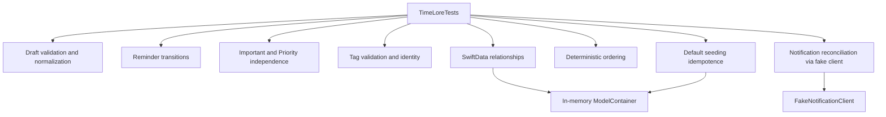

## 13.2 [`TimeLoreTests/ReminderDraftTests.swift`](../TimeLoreTests/ReminderDraftTests.swift)

### Purpose

Verifies form normalization and validation without UI or persistence.

| Lines | Explanation |
|---:|---|
| 1 | Foundation provides `Date`. |
| 2 | Imports Swift Testing. |
| 3 | Testable import exposes internal app types. |
| 5 | Declares a test-suite struct. Swift Testing discovers its `@Test` functions. |
| 6 | Fixed reference date prevents clock-dependent results. |
| 8 | Declares normalization test. |
| 9 | Creates draft with boundary spaces and newline. |
| 11 | Expects normalized title to remove spaces. |
| 12 | Expects normalized Notes to remove spaces/newline. |
| 13 | Closes test. |
| 15 | Declares blank-title test. |
| 16 | Creates whitespace-only title. |
| 18 | Expects exact user-facing title error. |
| 19 | Closes test. |
| 21 | Declares past-due test. |
| 22 | Sets due date one second before reference. |
| 24 | Expects future-date error. |
| 25 | Closes test. |
| 27 | Declares valid-future test. |
| 28 | Sets due date 60 seconds after reference. |
| 30 | Expects no error. |
| 31 | Closes test. |
| 33 | Declares edit-overdue exception test. |
| 34 | Creates exact overdue timestamp. |
| 35 | Draft uses that timestamp. |
| 37 | Passes same timestamp as original and expects validity. |
| 38–39 | Close test and suite. |

## 13.3 [`TimeLoreTests/ReminderLifecycleTests.swift`](../TimeLoreTests/ReminderLifecycleTests.swift)

### Purpose

Proves editing, completion, reopening, archive, restore, and idempotence rules.

| Lines | Explanation |
|---:|---|
| 1–3 | Import Foundation, Testing, and application module. |
| 5 | Suite declaration. |
| 6 | Fixed creation time. |
| 8 | Editing-preservation test. |
| 9 | Creates original reminder at known time. |
| 10 | Captures UUID before edit. |
| 11 | Creates exact later update time. |
| 12 | Creates related Work tag. |
| 14–18 | Calls update with padded title/Notes, tag, and explicit time. |
| 20 | Expects UUID unchanged. |
| 21 | Expects creation time unchanged. |
| 22 | Expects update time changed. |
| 23–24 | Expects normalized title/Notes. |
| 25 | Expects Work relationship. |
| 26 | Closes test. |
| 28 | Completion/reopen test. |
| 29–31 | Creates reminder and exact transition times. |
| 33 | Completes at known time. |
| 35–37 | Expects completed status and matching completion/update timestamps. |
| 39 | Reopens at later time. |
| 41–43 | Expects open status, nil completion, and reopened update time. |
| 44 | Closes test. |
| 46 | Repeated-completion test. |
| 47–48 | Creates reminder and first completion time. |
| 50–51 | Completes twice with different times. |
| 53–54 | Expects first timestamp preserved for completion and update. |
| 55 | Closes test. |
| 57 | Archive independence test. |
| 58–60 | Creates reminder and transition times. |
| 62 | Completes reminder. |
| 63 | Archives it later. |
| 65–67 | Expects completion state/history and archive time all present. |
| 69 | Restores later. |
| 71–72 | Expects still completed and no longer archived. |
| 73–74 | Close test and suite. |

## 13.4 [`TimeLoreTests/ReminderImportantTests.swift`](../TimeLoreTests/ReminderImportantTests.swift)

### Purpose

Proves Important and Priority are explicit, independent state dimensions.

| Lines | Explanation |
|---:|---|
| 1–3 | Imports. |
| 5–6 | Suite and fixed creation time. |
| 8 | Full-lifecycle Important test. |
| 9–10 | Creates reminder and flag time. |
| 12 | Flags it. |
| 13–16 | Completes, archives, restores, and reopens at increasing times. |
| 18 | Important must still be true. |
| 19–21 | Final lifecycle state is open, unarchived, and not completed. |
| 22 | Closes test. |
| 24 | Draft-copy test. |
| 25 | Constructs reminder from Important draft. |
| 27 | Expects stored flag. |
| 28 | Closes test. |
| 30 | Priority independence test. |
| 31–34 | Creates Important level-2 reminder. |
| 35 | Defines final update time. |
| 37–40 | Runs lifecycle transitions. |
| 41 | Changes priority to level 3. |
| 43–47 | Expects level 3, Important true, open, unarchived, and exact update time. |
| 48 | Closes test. |
| 50 | Important-only mutation test. |
| 51–54 | Creates and completes reminder. |
| 56 | Flags later. |
| 58–60 | Expects completion preserved, archive unchanged, and update time changed. |
| 61 | Closes test. |
| 63 | Edit Important test. |
| 64 | Creates unimportant reminder. |
| 65–69 | Updates it from Important draft. |
| 71 | Expects Important true. |
| 72–73 | Close test and suite. |

## 13.5 [`TimeLoreTests/ReminderTagTests.swift`](../TimeLoreTests/ReminderTagTests.swift)

| Lines | Explanation |
|---:|---|
| 1–2 | Imports Testing and application module. |
| 4 | Suite declaration. |
| 5 | Normalization test. |
| 6 | Creates tag with spaces, uppercase letters, and newline. |
| 8 | Expects display spelling `WORK`. |
| 9 | Expects identity `work`. |
| 10 | Closes test. |
| 12 | Equivalent-name test. |
| 13 | Expects `Work` and padded lowercase `work` to normalize identically. |
| 14 | Closes test. |
| 16 | Validation test. |
| 17 | Expects blank-name message. |
| 18 | Creates 31-character string and expects any error. |
| 19–20 | Close test and suite. |

## 13.6 [`TimeLoreTests/DefaultReminderTagSeederTests.swift`](../TimeLoreTests/DefaultReminderTagSeederTests.swift)

| Lines | Explanation |
|---:|---|
| 1–3 | Imports SwiftData, Testing, and app module. |
| 5 | Main-actor isolation matches SwiftData main context. |
| 6 | Suite declaration. |
| 7 | Idempotence test. |
| 8 | Creates isolated container. |
| 9 | Gets main context. |
| 11–12 | Seeds twice. |
| 13 | Saves context. |
| 15 | Fetches all tags. |
| 16 | Expects exact normalized default-name set. |
| 17 | Expects exactly six records. |
| 18 | Closes test. |
| 20 | Existing-case-variant test. |
| 21–22 | Creates isolated container/context. |
| 23 | Inserts uppercase Work first. |
| 25 | Runs seeder. |
| 26 | Saves. |
| 28 | Fetches tags. |
| 29 | Expects only one normalized Work. |
| 30 | Expects six total defaults. |
| 31 | Closes test. |
| 33 | Private container factory. |
| 34 | Registers models in in-memory configuration. |
| 35–36 | Close helper and suite. |

## 13.7 [`TimeLoreTests/ReminderSortingTests.swift`](../TimeLoreTests/ReminderSortingTests.swift)

| Lines | Explanation |
|---:|---|
| 1–3 | Imports. |
| 5 | Suite declaration. |
| 6 | Dated-before-undated test. |
| 7 | Fixed current time. |
| 8 | Undated reminder. |
| 9 | Later-dated reminder. |
| 10 | Sooner-dated reminder. |
| 12 | Sorts deliberately unordered array with production comparator. |
| 14 | Expects Sooner, Later, Undated. |
| 15 | Closes test. |
| 17 | Priority sort test. |
| 18 | Fixed time. |
| 19–21 | Creates levels 1, 3, and 2. |
| 23 | Sorts using production priority comparator. |
| 25 | Expects descending levels. |
| 26–27 | Close test and suite. |

## 13.8 [`TimeLoreTests/ReminderPersistenceTests.swift`](../TimeLoreTests/ReminderPersistenceTests.swift)

### Purpose

Exercises actual SwiftData behavior against an in-memory store rather than only testing plain object methods.

| Lines | Explanation |
|---:|---|
| 1–3 | Imports SwiftData, Testing, and app module. |
| 5 | Main-actor isolation. |
| 6 | Suite declaration. |
| 7 | Relationship persistence test. |
| 8–9 | Creates container/context. |
| 10–11 | Creates Work and Errands tags. |
| 12 | Creates reminder. |
| 13 | Assigns both tags. |
| 15 | Inserts reminder; SwiftData reaches related models through relationship. |
| 16 | Saves. |
| 18–19 | Fetches reminders and tags independently. |
| 21 | Expects one reminder. |
| 22 | Expects both normalized relationships. |
| 23 | Expects two tag records. |
| 24 | Closes test. |
| 26 | Nullify-delete-rule test. |
| 27–28 | Creates context. |
| 29–31 | Creates tag/reminder relationship. |
| 33–34 | Inserts and saves reminder graph. |
| 35 | Deletes tag. |
| 36 | Saves deletion. |
| 38 | Fetches reminders. |
| 40 | Expects reminder still exists. |
| 41 | Expects relationship array now empty. |
| 42 | Closes test. |
| 44 | Private container helper. |
| 45 | Creates in-memory configuration. |
| 46–50 | Builds container registering both models. |
| 51–52 | Close helper and suite. |

## 13.9 [`TimeLoreTests/ReminderNotificationPolicyTests.swift`](../TimeLoreTests/ReminderNotificationPolicyTests.swift)

### Production-service tests, lines 1–41

| Lines | Explanation |
|---:|---|
| 1–3 | Imports. |
| 5 | Main-actor isolation because service is main-actor bound. |
| 6 | Suite declaration. |
| 7 | Future/open scheduling test. |
| 8 | Fake starts not determined and will grant when requested. |
| 9 | Injects fake into production service. |
| 10 | Creates future-dated reminder. |
| 12 | Reconciles while allowing permission request. |
| 14 | Expects no denied guidance. |
| 15 | Expects exactly one authorization request. |
| 16 | Expects one scheduled UUID. |
| 17 | Closes test. |
| 19 | Completed/past cancellation test name. Current setup specifically exercises completion. |
| 20–22 | Authorized fake, service, future reminder. |
| 23 | Completes reminder. |
| 25 | Reconciles without prompting. |
| 27 | Expects no schedule. |
| 28 | Expects UUID cancellation. |
| 29 | Closes test. |
| 31 | Denied-permission test. |
| 32–34 | Denied fake, service, future reminder. |
| 36 | Reconciles without prompting. |
| 38 | Expects guidance true. |
| 39 | Expects no scheduling. |
| 40–41 | Close test and suite. |

### Fake client, lines 43–71

| Lines | Explanation |
|---:|---|
| 43 | Main-actor isolation. |
| 44 | Private final class conforms to production protocol. |
| 45 | Mutable current authorization. |
| 46 | Fixed result to return after request. |
| 47 | Read-only-outside request counter. |
| 48 | Recorded scheduled IDs. |
| 49 | Recorded canceled IDs. |
| 51–54 | Initializer stores current and requested results; requested result defaults denied. |
| 56 | Status function immediately returns stored authorization. |
| 58 | Begins request function. |
| 59 | Increments call count. |
| 60 | Replaces authorization with configured result. |
| 61 | Returns new authorization. |
| 62 | Closes request. |
| 64 | Schedule protocol implementation. Other parameters are intentionally unused by this test fake. |
| 65 | Records reminder ID. |
| 66 | Closes schedule. |
| 68 | Cancel implementation. |
| 69 | Records reminder ID. |
| 70–71 | Close cancel and fake class. |

---

# 14. UI tests

## [`TimeLoreUITests/TimeLoreUITests.swift`](../TimeLoreUITests/TimeLoreUITests.swift)

### Purpose

These tests launch TimeLore as a separate process and interact with its accessibility hierarchy. They validate that models, services, persistence configuration, and views work together through user-visible paths.

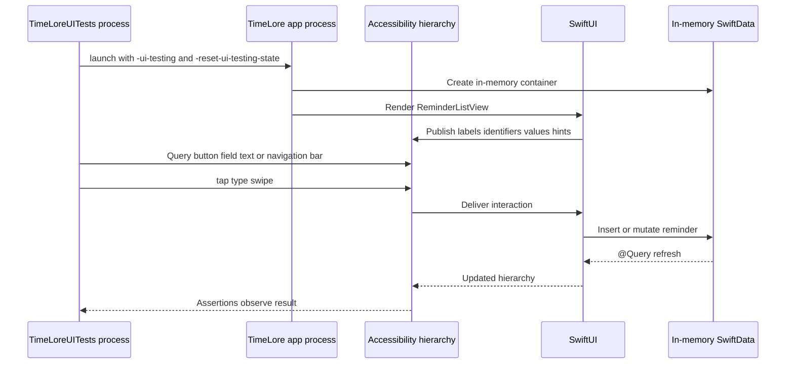

### Setup, lines 1–6

| Lines | Explanation |
|---:|---|
| 1 | Imports XCTest, including XCUITest APIs. |
| 3 | Declares XCTestCase subclass. |
| 4 | Overrides per-test setup. |
| 5 | Stops after first assertion failure to prevent cascading invalid interactions. |
| 6 | Closes setup. |

### Initial screen test, lines 8–20

| Lines | Explanation |
|---:|---|
| 8 | Test name describes seeded tags and editor opening. |
| 9 | Creates configured application object. |
| 10 | Launches separate process. |
| 12 | Waits up to two seconds for true empty-state text. |
| 13 | Expects Work filter. |
| 14 | Expects Important filter. |
| 16 | Taps first New reminder button; both toolbar and empty state may expose same label. |
| 17 | Waits for New reminder navigation bar. |
| 18 | Expects title field. |
| 19 | Expects Work tag button. |
| 20 | Closes test. |

### Sort test, lines 22–31

| Lines | Explanation |
|---:|---|
| 22 | Test declaration. |
| 23–24 | Create and launch app. |
| 26 | Finds sort by identifier. |
| 27 | Opens menu. |
| 28 | Selects Priority. |
| 30 | Expects accessibility value “Priority.” |
| 31 | Closes test. |

### Create/filter/search/detail test, lines 33–61

| Lines | Explanation |
|---:|---|
| 33 | Broad end-to-end test declaration. |
| 34–35 | Launch app. |
| 37 | Open editor. |
| 38 | Find Important switch by identifier. |
| 39 | Tap near switch trailing edge using normalized coordinate for reliable toggle activation. |
| 40 | Expect switch value `1`. |
| 41–42 | Focus and type title. |
| 43–44 | Focus and type Notes. |
| 45 | Select Errands tag. |
| 46 | Save. |
| 48 | Wait for created title on Home. |
| 49 | Activate Important filter. |
| 50 | Expect reminder remains visible. |
| 52 | Restore All filter. |
| 53–54 | Focus search and enter Notes-only query. |
| 55 | Expect title still found through Notes match. |
| 56 | Tap title to navigate. |
| 57 | Wait for detail navigation bar. |
| 58 | Expect NOTES section. |
| 59 | Expect detail Important switch on. |
| 60 | Expect Errands text. |
| 61 | Closes test. |

### Disclosure test, lines 63–75

| Lines | Explanation |
|---:|---|
| 63–66 | Launch and create reminder through helper. |
| 68 | Find Open disclosure. |
| 69 | Wait for disclosure. |
| 70 | Confirm row visible. |
| 71 | Tap to collapse. |
| 72 | Confirm row absent. |
| 73 | Tap to expand. |
| 74 | Confirm row returns. |
| 75 | Closes test. |

### Directional swipe test, lines 77–91

| Lines | Explanation |
|---:|---|
| 77–80 | Launch and create reminder. |
| 82 | Swipe row left. |
| 83 | Tap revealed Flag. |
| 84 | Select Important filter. |
| 85 | Confirm flagged row is included. |
| 87 | Return to All. |
| 88 | Swipe row right, allowing full-swipe completion behavior. |
| 89 | Tap Completed disclosure to expand it. |
| 90 | Confirm row moved there. |
| 91 | Closes test. |

### Completion-control test, lines 93–103

| Lines | Explanation |
|---:|---|
| 93–96 | Launch and create reminder. |
| 98 | Tap reminder-specific completion accessibility button. |
| 100 | Assert detail navigation did not occur. |
| 101 | Expand Completed. |
| 102 | Confirm row appears. |
| 103 | Closes test. |

### Full maintenance test, lines 105–136

| Lines | Explanation |
|---:|---|
| 105–108 | Launch and create reminder. |
| 110 | Open detail. |
| 111 | Open overflow. |
| 112 | Select Edit. |
| 113–114 | Add Notes. |
| 115 | Save edit. |
| 116 | Confirm detail updates. |
| 118 | Complete via detail status action. |
| 119 | Confirm action label now contains Reopen. |
| 120 | Reopen. |
| 122–123 | Open overflow and archive. |
| 124–125 | Open overflow and restore. |
| 127–128 | Start deletion. |
| 129 | Cancel alert deletion. |
| 130 | Confirm still on detail. |
| 132–134 | Start deletion again and confirm destructive action. |
| 135 | Confirm Home empty state. |
| 136 | Closes test. |

### Test helpers, lines 138–151

| Lines | Explanation |
|---:|---|
| 138 | Application factory. |
| 139 | Creates `XCUIApplication`. |
| 140 | Supplies memory-store and preference-reset launch arguments. |
| 141 | Returns configured handle. |
| 142 | Closes helper. |
| 144 | Creation helper accepts title and app handle. |
| 145 | Opens editor. |
| 146 | Focuses title. |
| 147 | Types caller-provided title. |
| 148 | Saves. |
| 149 | Waits for visible created title. |
| 150–151 | Close helper and test class. |

### Unit versus UI tests

| Property | Unit tests | UI tests |
|---|---|---|
| Speed | Fast | Slower |
| Process | Usually same test host | Separate app process |
| Access | Calls Swift functions directly | Uses accessibility elements |
| Failure diagnosis | Narrow and precise | Broader integration signal |
| System UI | Avoided/faked | Can exercise visible app UI |
| Best use | Rules, edge cases, persistence services | Critical user journeys and interaction direction |

---

# 15. Xcode project and scheme files

## 15.1 [`TimeLore.xcodeproj/project.pbxproj`](../TimeLore.xcodeproj/project.pbxproj)

### Purpose

This is Xcode’s serialized project graph. It describes file references, groups, targets, build phases, products, dependencies, and build settings. Xcode normally edits it through the graphical project editor.

### Lines 1–6: file header

| Lines | Explanation |
|---:|---|
| 1 | Declares UTF-8 project format marker. |
| 2 | Opens root dictionary. |
| 3 | Archive format version. |
| 4 | Empty legacy classes dictionary. |
| 5 | Object schema version used by Xcode. |
| 6 | Opens object-ID dictionary. |

### Lines 8–30: `PBXBuildFile`

Each entry connects a file reference to a build phase. Lines 9–29 create build-file objects for:

- Application Swift sources.
- Unit-test Swift sources.
- UI-test Swift source.
- Asset catalog resource.

The hexadecimal-looking IDs are project-unique object identifiers. Comments make references human-readable.

### Lines 32–57: `PBXFileReference`

- Lines 33–40 reference initial Swift files.
- Lines 41–43 reference built `.app` and `.xctest` products in `BUILT_PRODUCTS_DIR`.
- Lines 44–56 reference remaining Swift files and asset catalog.
- `lastKnownFileType = sourcecode.swift` tells Xcode how to edit/compile Swift files.
- `sourceTree = "<group>"` resolves paths relative to their containing Xcode group.
- Product references use explicit wrapper/bundle types because they are generated outputs.

### Lines 59–63: framework phases

One Frameworks phase exists per target. Their file lists are empty because the project has no linked third-party package products or manually added framework binaries.

### Lines 65–76: navigator groups

| Line | Group |
|---:|---|
| 66 | Root group: TimeLore, tests, UI tests, products |
| 67 | App group: entry, Models, Features, Resources, Services |
| 68 | Models group |
| 69 | Features group |
| 70 | Reminder feature group |
| 71 | Unit-test group |
| 72 | UI-test group |
| 73 | Generated Products group |
| 74 | Resources group |
| 75 | Services group |

These groups determine the Project Navigator hierarchy. In this project they also carry filesystem paths.

### Lines 78–82: native targets

| Line | Target meaning |
|---:|---|
| 79 | `TimeLore`: iOS application product with Sources, Frameworks, and Resources phases. |
| 80 | `TimeLoreTests`: unit-test bundle depending on the app target. |
| 81 | `TimeLoreUITests`: UI-test bundle depending on the app target. |

### Lines 84–86: project object

The single top-level `PBXProject` records:

- Xcode tool/version metadata.
- Test-target associations.
- Project build configurations.
- English/Base regions.
- Main navigator group.
- Products group.
- All three targets.

### Lines 88–90: Resources phase

The application Resources phase contains `Assets.xcassets`. Xcode compiles it and places results in the app bundle.

### Lines 92–96: Sources phases

| Line | Compiled target membership |
|---:|---|
| 93 | All production Swift files compile into TimeLore.app. |
| 94 | All unit-test Swift files compile into TimeLoreTests.xctest. |
| 95 | `TimeLoreUITests.swift` compiles into TimeLoreUITests.xctest. |

A file existing on disk is not sufficient; target membership determines whether it is compiled.

### Lines 98–101: dependencies

Both test targets point to the TimeLore target. Xcode therefore builds the application before either test bundle needs it.

### Lines 103–112: build settings

Lines 104–111 contain dense one-line dictionaries.

#### Project Debug, line 104

- `APP_DISPLAY_NAME = TimeLore`: shared visible/product name.
- `ENABLE_TESTABILITY = YES`: exposes internal symbols for `@testable`.
- `SWIFT_ACTIVE_COMPILATION_CONDITIONS = DEBUG ...`: enables conditional Debug code.
- `SWIFT_OPTIMIZATION_LEVEL = -Onone`: preserves debuggability.
- `DEBUG_INFORMATION_FORMAT = dwarf`: Debug symbols.
- Clang/C settings are inherited project defaults even though current production code is Swift.

#### Project Release, line 105

- Uses `dwarf-with-dsym` for symbolicated crash reports.
- Uses whole-module Swift compilation.
- Omits Debug-specific testability/no-optimization settings.

#### App Debug and Release, lines 106–107

- `ASSETCATALOG_COMPILER_APPICON_NAME = AppIcon`: selects icon set.
- `CODE_SIGN_STYLE = Automatic`: Xcode manages signing.
- `CURRENT_PROJECT_VERSION = 1`: build number.
- `DEVELOPMENT_TEAM = ""`: no team committed.
- `GENERATE_INFOPLIST_FILE = YES`: no hand-written Info.plist is required.
- `INFOPLIST_KEY_CFBundleDisplayName = $(APP_DISPLAY_NAME)`: generated visible name.
- Scene manifest, launch screen, and indirect input settings are generated.
- `IPHONEOS_DEPLOYMENT_TARGET = 17.0`: minimum OS.
- `MARKETING_VERSION = 0.1.0`: user-facing version.
- `PRODUCT_BUNDLE_IDENTIFIER = com.breadcrumb.app`: installation/signing identity.
- `PRODUCT_NAME = $(APP_DISPLAY_NAME)`: built product name.
- `SUPPORTED_PLATFORMS`: device and simulator.
- `SWIFT_VERSION = 5.0`: selected language compatibility mode.
- `TARGETED_DEVICE_FAMILY = 1,2`: iPhone and iPad families, although product UI is specified primarily for iPhone.

#### Unit tests, lines 108–109

- `BUNDLE_LOADER` and `TEST_HOST` load the test bundle into the built application host.
- Separate test bundle identifier.
- Generated Info.plist.
- iOS 17 and Swift 5 settings.

#### UI tests, lines 110–111

- Separate UI-test bundle identifier.
- `TEST_TARGET_NAME = TimeLore` identifies the app to automate.
- Generated Info.plist, iOS 17, Swift 5, and device-family settings.

### Lines 114–119: configuration lists

Connect Debug and Release build configurations to:

- App target.
- Unit-test target.
- UI-test target.
- Whole project.

`defaultConfigurationName = Release` is the fallback when a build action does not specify a configuration.

### Lines 120–122

Close the object/root dictionaries and identify the top-level project object ID.

## 15.2 [`TimeLore.xcodeproj/project.xcworkspace/contents.xcworkspacedata`](../TimeLore.xcodeproj/project.xcworkspace/contents.xcworkspacedata)

| Lines | Explanation |
|---:|---|
| 1 | XML declaration. |
| 2–3 | Opens Workspace version 1.0. |
| 4–6 | `FileRef location="self:"` means workspace contains this project itself. |
| 7 | Closes workspace. |

No external project or Swift package workspace references appear here.

## 15.3 [`TimeLore.xcodeproj/xcshareddata/xcschemes/TimeLore.xcscheme`](../TimeLore.xcodeproj/xcshareddata/xcschemes/TimeLore.xcscheme)

| Lines | Explanation |
|---:|---|
| 1 | XML declaration. |
| 2 | Scheme metadata/version. |
| 3 | Build action can parallelize and build implicit dependencies. |
| 4 | Opens build entries. |
| 5 | App build entry participates in testing, running, profiling, archiving, and analyzing. |
| 6 | Reference points to TimeLore target/product in this project. |
| 7–9 | Close entry/list/build action. |
| 10 | Test action uses Debug and LLDB. |
| 11 | Opens testables. |
| 12–14 | Includes unit-test bundle and does not skip it. |
| 15–17 | Includes UI-test bundle and does not skip it. |
| 18–19 | Close testables/action. |
| 20 | Launch action uses Debug, LLDB, no custom directory, and allows location simulation. |
| 21–23 | Runs TimeLore.app as buildable product. |
| 24 | Closes launch action. |
| 25 | Profile action uses Release. |
| 26–28 | Profiles TimeLore.app. |
| 29 | Closes profile. |
| 30 | Analyze uses Debug. |
| 31 | Archive uses Release and reveals Organizer. |
| 32 | Closes scheme. |

Because this file is under `xcshareddata`, every clone receives the same build/test scheme.

---

# 16. Assets and resources

## 16.1 [`TimeLore/Resources/Assets.xcassets/Contents.json`](../TimeLore/Resources/Assets.xcassets/Contents.json)

| Lines | Explanation |
|---:|---|
| 1 | Opens JSON object. |
| 2 | Opens asset-catalog metadata. |
| 3 | Records author as Xcode. |
| 4 | Asset metadata format version 1. |
| 5–6 | Close metadata and root. |

## 16.2 [`TimeLore/Resources/Assets.xcassets/AppIcon.appiconset/Contents.json`](../TimeLore/Resources/Assets.xcassets/AppIcon.appiconset/Contents.json)

| Lines | Explanation |
|---:|---|
| 1 | Opens JSON object. |
| 2 | Starts image declarations. |
| 3 | Starts one image record. |
| 4 | Source filename is `TimeLoreAppIcon.png`. |
| 5 | Universal idiom. |
| 6 | iOS platform. |
| 7 | 1024×1024 source size. |
| 8–9 | Close image record/array. |
| 10–13 | Xcode author and version metadata. |
| 14 | Closes root object. |

Xcode’s asset compiler derives the necessary device icon renditions from the 1024×1024 source.

## 16.3 [`TimeLoreAppIcon.png`](../TimeLore/Resources/Assets.xcassets/AppIcon.appiconset/TimeLoreAppIcon.png)

The icon contains the legacy Breadcrumb “B,” an orange accent, a flag, and breadcrumb-like particles. It is compiled into the app bundle and appears in system launch/Home Screen surfaces. It is not rendered by any SwiftUI `Image` in the current screens.

---

# 17. Project rename script

## [`scripts/rename-project.sh`](../scripts/rename-project.sh)

### Purpose

Performs a coordinated Git-aware rename of project, target-related folders, scheme, selected filenames, and text references. It is developer tooling and never ships in the iOS application.

| Lines | Explanation |
|---:|---|
| 1 | Shebang asks environment to locate Bash. |
| 2 | Enables exit-on-error, unset-variable errors, and pipeline failure propagation. |
| 4 | Reads `OLD_NAME` environment variable or defaults to TimeLore. |
| 5 | Reads first positional argument as new name or empty. |
| 7 | Checks missing new name. |
| 8 | Prints usage to standard error; includes resolved old name and script path. |
| 9 | Exits with status 2 for invalid command usage. |
| 10 | Closes condition. |
| 12 | Validates new name with regular expression: leading ASCII letter, then alphanumerics. |
| 13 | Prints naming rule. |
| 14 | Exits usage error. |
| 15 | Closes condition. |
| 17 | Rejects identical old/new names. |
| 18 | Prints no-op message. |
| 19 | Exits usage error. |
| 20 | Closes condition. |
| 22 | Uses Git to discover repository root. |
| 23 | Changes working directory there. |
| 25 | Iterates required project/app/test paths. |
| 26 | Checks each path exists. |
| 27 | Reports missing path to standard error. |
| 28 | Exits operational error 1. |
| 29–30 | Close check and loop. |
| 32 | Comment explains rename ordering. |
| 33 | `git mv` renames Xcode project while preserving Git history. |
| 35 | Checks old shared scheme exists inside renamed project. |
| 36–37 | Renames scheme with continued command line. |
| 38 | Closes condition. |
| 39 | Renames app source directory. |
| 40 | Renames unit-test directory. |
| 41 | Renames UI-test directory. |
| 43 | Checks entry filename follows old-name convention. |
| 44 | Renames application entry file. |
| 45 | Closes condition. |
| 47 | Checks icon filename follows old-name convention. |
| 48–49 | Renames icon. |
| 50 | Closes condition. |
| 52 | Checks UI-test filename follows old-name convention. |
| 53 | Renames UI-test file. |
| 54 | Closes condition. |
| 56 | Comment describes text replacement phase. |
| 57 | Reads each matching tracked text file safely one line at a time. |
| 58 | Perl replaces all literal old-name occurrences with new name. `\Q...\E` quotes regex metacharacters. |
| 59 | Process substitution feeds files found by `git grep`; excludes user state/build output and tolerates no matches. |
| 61 | Reports rename completion. |
| 62 | Reminds developer to review, build, and test. |

---

# 18. Documentation map

## 18.1 Authority and reading order

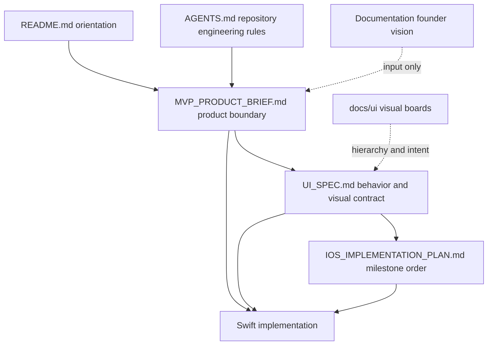

When documents conflict:

1. Current MVP boundary wins over founder vision.
2. UI Specification controls behavior and interaction direction.
3. Implementation Plan controls milestone order/status.
4. Visual boards communicate hierarchy rather than fixed coordinates.

## 18.2 Active files

| File | Role |
|---|---|
| [`README.md`](../README.md) | Short repository orientation, product summary, prerequisites, and pointers. |
| [`AGENTS.md`](../AGENTS.md) | Repository engineering constraints, MVP guardrails, validation, and definition of done. |
| [`docs/MVP_PRODUCT_BRIEF.md`](MVP_PRODUCT_BRIEF.md) | Target user, product bet, requirements, non-goals, success measures, expansion gate. |
| [`docs/UI_SPEC.md`](UI_SPEC.md) | Page anatomy, filters, swipes, appearance, accessibility, error states, and acceptance checklist. |
| [`docs/IOS_IMPLEMENTATION_PLAN.md`](IOS_IMPLEMENTATION_PLAN.md) | Project settings, milestones, acceptance criteria, test strategy, and current status. |
| [`docs/PROJECT_IDENTITY.md`](PROJECT_IDENTITY.md) | Display name, target/module names, bundle ID continuity, and rename procedure. |
| `docs/ui/mvp-*.webp` | Current MVP visual references. |
| `docs/ui/post-mvp-*.webp` | Gated concept references, not implementation approval. |

## 18.3 Long-term founder documents

Files under `Documentation/` describe broader product/startup vision. They may help explain why the repository exists, but they are not an implementation backlog and cannot authorize post-MVP scope by themselves.

## 18.4 Local/generated metadata

| File/type | Meaning |
|---|---|
| `.DS_Store` | Finder folder-view metadata; no app meaning. |
| `xcuserdata/.../UserInterfaceState.xcuserstate` | One developer’s Xcode window/editor state; not product code. |
| `.gitignore` | Patterns Git should not track. |
| `.agents/skills/...` | Repository-specific coding-agent workflow instructions; not app runtime. |

## 18.5 `.gitignore`, line by line

| Line | Explanation |
|---:|---|
| 1 | Comment labels Xcode-generated/user-local exclusions. |
| 2 | Ignores `DerivedData/`, where Xcode places intermediates, indexes, and build products. |
| 3 | Ignores a repository-local `build/` output directory. |
| 4 | Ignores any Xcode UI-state file ending in `.xcuserstate`. |
| 5 | Ignores user-specific Xcode settings directories. |
| 6 | Blank separator. |
| 7 | Comment labels macOS metadata exclusion. |
| 8 | Ignores Finder-created `.DS_Store` files. |

The `.DS_Store` files currently visible in the working directory are local metadata and do not belong to the application architecture.

## 18.6 Repository skill metadata

| File | Role |
|---|---|
| `.agents/skills/breadcrumb-ios-development/SKILL.md` | Defines the Xcode-first engineering workflow, architectural defaults, verification rules, and reporting expectations for coding agents. |
| `.agents/skills/breadcrumb-ios-development/agents/openai.yaml` line 1 | Opens interface metadata. |
| `openai.yaml` line 2 | Provides the visible skill name “TimeLore iOS Development.” |
| `openai.yaml` line 3 | Provides the short description shown in skill-selection surfaces. |
| `openai.yaml` line 4 | Provides the default prompt for invoking the skill. |

These files guide development tooling; the Xcode targets never compile them.

## 18.7 Complete founder-document inventory

| File | Long-term role; not current MVP authority |
|---|---|
| `Documentation/Breadcrumb AI Agent Handoff.md` | Describes the original Personal Memory Operating System vision and gives broad agent context. |
| `Documentation/Breadcrumb App Concept.md` | Explains the original reminder/context problem, tagline, and expanded product concept. |
| `Documentation/Breadcrumb Founder Checklist.md` | Lists founder, discovery, strategy, product, company, and execution activities. |
| `Documentation/Breadcrumb Founder Package.md` | Summarizes founder narrative, thesis, market framing, and proposed broader modules. |
| `Documentation/Breadcrumb Full Startup Suite.md` | Combines product and startup planning around the broader “Search Engine for Your Life” vision. |
| `Documentation/Breadcrumb Startup Product Spec.md` | Original broad product specification for reminders plus a personal knowledge graph. |
| `Documentation/Breadcrumb Venture Scale Founder Package.md` | Venture-scale positioning, mission, and long-term company thesis. |
| `Documentation/Breadcrumb_Consolidated_Founder_Dossier.md` | Consolidated venture/startup blueprint and founder narrative. |

## 18.8 Visual-board inventory

| File | Meaning |
|---|---|
| `docs/ui/mvp-home-tags-swipes.webp` | Current MVP Home hierarchy, filters, tag styling, Important state, and swipe direction. |
| `docs/ui/mvp-capture-detail-dark.webp` | Current MVP creation/detail hierarchy and dark-mode intent. |
| `docs/ui/post-mvp-core-navigation.webp` | Gated Timeline/Today/Future/Insights navigation concept. |
| `docs/ui/post-mvp-capture-life-search.webp` | Gated richer capture and life-search concept. |
| `docs/ui/post-mvp-connected-spaces-trust.webp` | Gated project/person/place/trust concept. |

The boards are not inside `Assets.xcassets`, so they are not bundled with the application.

---

# 19. End-to-end feature traces

## 19.1 Create a reminder

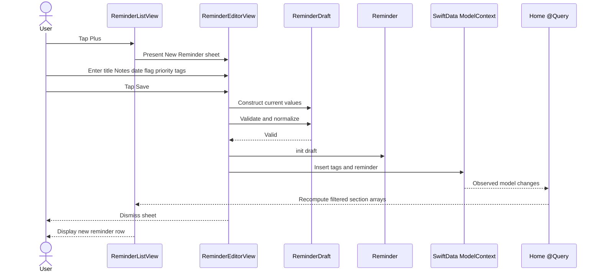

Relevant code:

- `ReminderListView` lines 118–125.
- `ReminderEditorView` lines 200–244.
- `ReminderDraft` lines 10–36.
- `Reminder` lines 50–62.

## 19.2 Complete and reopen

```mermaid
sequenceDiagram
    actor User
    participant Home as ReminderListView
    participant Model as Reminder
    participant Notify as ReminderNotificationService
    participant Query as @Query and computed sections

    User->>Home: Swipe right or tap circle
    Home->>Model: complete()
    Model->>Model: status completed; set completedAt/updatedAt
    Home->>Notify: reconcile without prompt
    Notify->>Notify: policy fails because status completed
    Notify-->>Home: cancel pending UUID
    Model-->>Query: observation change
    Query-->>User: Row moves Open to Completed

    User->>Home: Reopen
    Home->>Model: reopen()
    Model->>Model: status open; clear completedAt
    Home->>Notify: reconcile without prompt
    Notify-->>Home: schedule only if due date remains future and permission authorized
    Query-->>User: Row moves Completed to Open
```

## 19.3 Archive and restore preserve status

```mermaid
stateDiagram-v2
    Open --> ArchivedOpen: archive
    ArchivedOpen --> Open: restore
    Completed --> ArchivedCompleted: archive
    ArchivedCompleted --> Completed: restore

    note right of ArchivedOpen
        status remains open
        archivedAt is present
    end note

    note right of ArchivedCompleted
        status remains completed
        completedAt remains present
        archivedAt is present
    end note
```

## 19.4 Search and filtering

```mermaid
flowchart TD
    all["All stored reminders"] --> search{"Search query empty?"}
    search -->|Yes| searchPass["Pass all"]
    search -->|No| textMatch["Title or Notes case-insensitive contains query"]
    searchPass --> filter
    textMatch --> filter{"Selected filter"}
    filter --> allFilter["All: pass"]
    filter --> important["Important: isImportant"]
    filter --> untagged["Untagged: tags empty"]
    filter --> tag["Tag: relationship contains normalized name"]
    allFilter --> sections["Split into Open Completed Archived"]
    important --> sections
    untagged --> sections
    tag --> sections
```

## 19.5 Delete

```mermaid
sequenceDiagram
    actor User
    participant Detail as ReminderDetailView
    participant Alert
    participant Notify as ReminderNotificationService
    participant Context as ModelContext
    participant Home as ReminderListView

    User->>Detail: Overflow then Delete
    Detail->>Alert: Present confirmation
    alt Cancel
        User->>Alert: Cancel
        Alert-->>Detail: Dismiss only
    else Confirm Delete
        User->>Alert: Delete
        Detail->>Notify: cancel reminder UUID
        Detail->>Context: delete reminder
        Detail->>Home: dismiss detail
        Context-->>Home: @Query removes row
    end
```

---

# 20. What is deliberately absent

## 20.1 Approved but not implemented

There are currently no Swift files or stored fields for:

- `RepeatRule`.
- Recurrence series identity.
- Occurrence history.
- Recurrence editor/detail UI.
- Attachment metadata.
- Attachment payload storage.
- Photo picker integration.
- Document picker integration.
- Contact picker/vCard snapshots.
- Attachment preview/removal/cleanup.

Do not infer these features from prose in `README.md` or `UI_SPEC.md`. Those documents define intended MVP completion, while code status remains earlier.

## 20.2 Post-MVP omissions

- No OCR.
- No AI or semantic search.
- No cloud/database server.
- No user accounts.
- No multi-device sync.
- No multi-tab Timeline/Today/Future/Insights shell.
- No standalone Memory, Photo, Receipt, Place, Person, or Project model.

## 20.3 Engineering files intentionally absent

- No third-party `Package.swift` or package dependencies.
- No manually maintained `Info.plist`; Xcode generates it.
- No entitlements file or CloudKit capability.
- No networking layer.
- No generic ViewModel classes that merely relay SwiftData properties.

---

# 21. Recommended study exercises

## 21.1 Beginner: observe the create flow

1. Open `ReminderEditorView.swift`.
2. Set a breakpoint at `save()` line 200.
3. Run the app in a simulator.
4. Enter padded title text such as `  Study Swift  `.
5. Step into `ReminderDraft.validationError`.
6. Inspect `normalizedTitle`.
7. Step through `Reminder(draft:)`.
8. Watch Home refresh without a manual reload call.

Concepts: bindings, state, computed properties, initialization, SwiftData observation.

## 21.2 Beginner: trace one SwiftUI control

Trace the Important toggle from editor to list:

```text
Toggle binding
→ ReminderEditorView.isImportant @State
→ ReminderDraft.isImportant
→ Reminder.init(draft:)
→ Reminder.isImportant persisted Boolean
→ ReminderRowContent flag icon
→ matchesTagFilter(.important)
```

Then repeat the trace for Priority and identify where it differs.

## 21.3 Intermediate: understand `Binding`

Compare:

- Editor’s direct `$isImportant` binding to local state.
- Detail’s manually constructed `Binding(get:set:)` to a live model.

Explain why the editor should not mutate the stored reminder on every keystroke, while detail’s direct Important/Priority controls are intended to act immediately.

## 21.4 Intermediate: add one validation test

Add focused tests for:

- Exactly 200 title characters: valid.
- 201 title characters: invalid.
- Exactly 2,000 Notes characters: valid.
- 2,001 Notes characters: invalid.

Predict the results before running them.

## 21.5 Intermediate: test the missing past-date branch

The notification test named `completedOrPastReminderCancelsNotification` currently exercises completed status. Add a separate past-due open reminder test so both halves of the name are directly covered.

## 21.6 Intermediate: examine SwiftData autosave

1. Put breakpoints in editor save.
2. Observe that it does not call `modelContext.save()`.
3. Create a production reminder.
4. Terminate and relaunch the app.
5. Verify whether autosave persisted it.
6. Compare with explicit save during launch seeding and in persistence tests.

## 21.7 Advanced: model state dimensions

List every valid combination of:

- `status`: open/completed.
- `archivedAt`: nil/present.
- `isImportant`: false/true.
- `priority`: none/level1/level2/level3.

There are `2 × 2 × 2 × 4 = 32` combinations before tags/due dates. Identify which UI section and markers each combination produces.

## 21.8 Advanced: design recurrence without implementing it

Using the current patterns, propose—but do not yet code—types for:

- Repeat cadence.
- Series identity.
- Occurrence identity.
- Completion history.
- Notification identifiers.

Then evaluate the proposal against Milestone 5’s daylight-saving and end-of-month requirements.

## 21.9 Xcode debugging checklist

- Use the Project Navigator to locate each file group.
- Use the breakpoint navigator to organize study breakpoints.
- Use Quick Look on `Date`, `UUID`, and arrays.
- Use the Variables view to inspect `@State` backing values.
- Use Debug View Hierarchy to inspect List/Form composition.
- Use the Accessibility Inspector for labels, values, and hints.
- Use the Test Navigator to run one test function before the full suite.
- Use the Report Navigator to inspect build/test logs.

---

# 22. Glossary

| Term | Meaning in this project |
|---|---|
| Actor | Swift concurrency isolation boundary. `@MainActor` protects UI/main-context operations. |
| App bundle | Built `.app` directory containing executable, generated Info.plist, and compiled resources. |
| Binding | Two-way read/write connection between a control and state. |
| Build phase | Target step such as Sources, Frameworks, or Resources. |
| Computed property | Property whose getter/setter executes code rather than storing independent data. |
| Dependency injection | Providing a dependency from outside, such as a fake notification client in tests. |
| Domain rule | Product behavior independent of screen layout, such as completion preserving Important. |
| Environment | SwiftUI dependency/value propagation system. |
| Existential | A value of `any Protocol` whose concrete conforming type may vary. |
| `final` | Prevents a class from being subclassed. |
| `ForEach` | SwiftUI container that creates child views from identifiable data. |
| Guard | Early-exit statement used to enforce preconditions or idempotence. |
| Idempotent | Repeating an operation has no additional effect after the first successful result. |
| In-memory store | Temporary SwiftData storage discarded when process/container ends. |
| Inverse relationship | Opposite side of a SwiftData relationship, linking tags back to reminders. |
| Main actor | Concurrency executor associated with UI-safe work. |
| ModelContext | SwiftData workspace that tracks inserts, mutations, fetches, saves, and deletes. |
| ModelContainer | Owns SwiftData schema and storage configuration and provides contexts. |
| Modifier | SwiftUI operation that wraps/transforms a view, such as `.padding()` or `.background()`. |
| Normalization | Converting user input into stable display or comparison form. |
| Optional | Value that may contain a wrapped value or `nil`. |
| Opaque return type | `some View`/`some Scene`: compiler knows concrete type while caller sees protocol capabilities. |
| Property wrapper | Attribute-backed behavior such as `@State`, `@Query`, or `@AppStorage`. |
| Protocol | Interface declaring required behavior without selecting implementation. |
| Raw value | Primitive representation behind an enum case, such as status string or priority integer. |
| Reactive query | `@Query` fetch that causes SwiftUI updates when observed models change. |
| Reference semantics | Multiple variables/views can refer to the same class instance. |
| Scheme | Xcode configuration describing Build, Run, Test, Profile, Analyze, and Archive actions. |
| SF Symbols | Apple’s system icon library referenced by names such as `flag.fill`. |
| SwiftData | Apple persistence framework used for Reminder and ReminderTag. |
| Target | Xcode build unit producing an app or test bundle. |
| UserDefaults | Small key-value preference store used through `@AppStorage`. |
| Value semantics | Copying a struct creates an independent value, as with `ReminderDraft`. |
| View builder | Result-builder syntax allowing declarative, conditional SwiftUI child views. |

---

## Final mental model

```mermaid
flowchart TB
    user["User interaction"] --> views["SwiftUI views"]
    views --> draft["Temporary @State and ReminderDraft"]
    views --> domain["Reminder and ReminderTag domain models"]
    domain --> swiftData["SwiftData ModelContext and local store"]
    swiftData --> query["Reactive @Query"]
    query --> views

    views --> service["ReminderNotificationService"]
    service --> policy["Pure scheduling policy"]
    service --> client["ReminderNotificationClient protocol"]
    client --> system["UNUserNotificationCenter in production"]
    client --> fake["Fake client in tests"]

    unit["Unit tests"] --> draft
    unit --> domain
    unit --> swiftData
    unit --> fake
    uiTests["UI tests"] --> user
```

TimeLore’s architecture is small but purposeful: views describe presentation and interaction, models own persisted state and domain transitions, services isolate system work, SwiftData connects persistence to reactive UI, and tests exercise each layer at the appropriate boundary.
