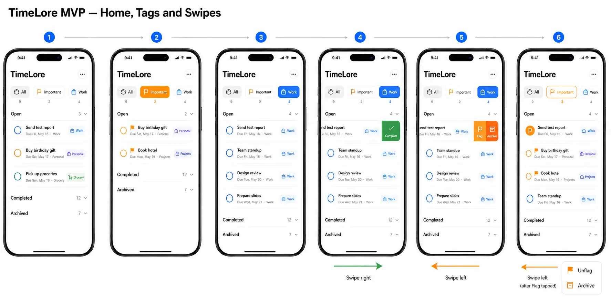
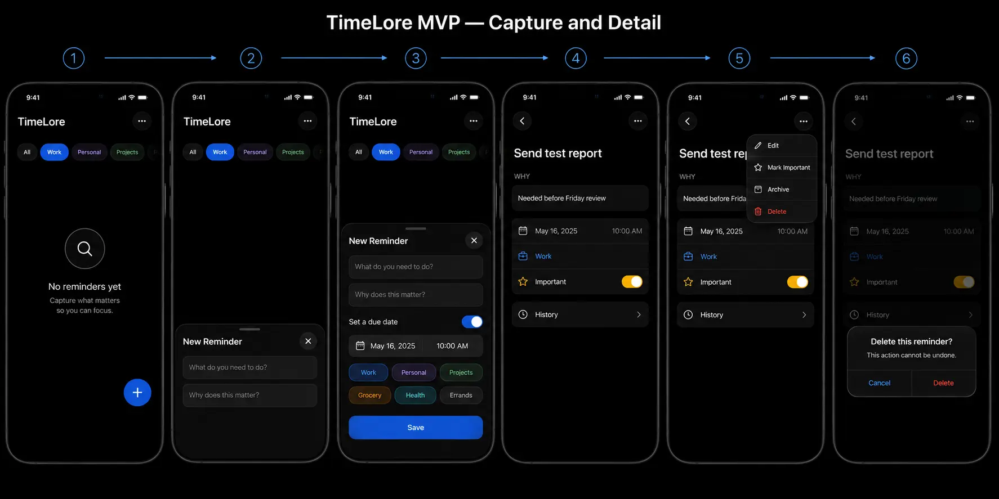
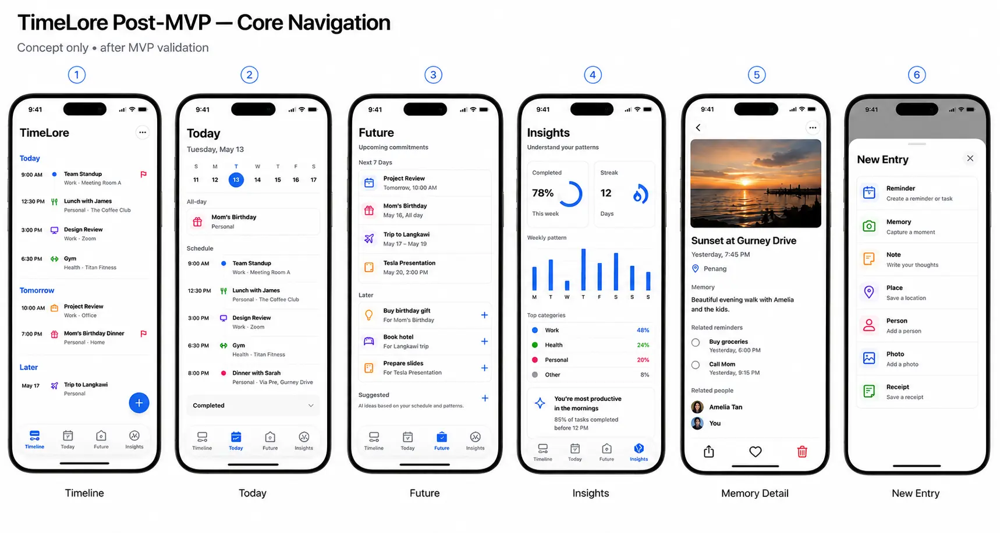
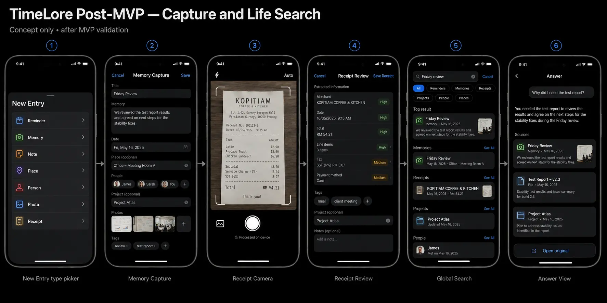
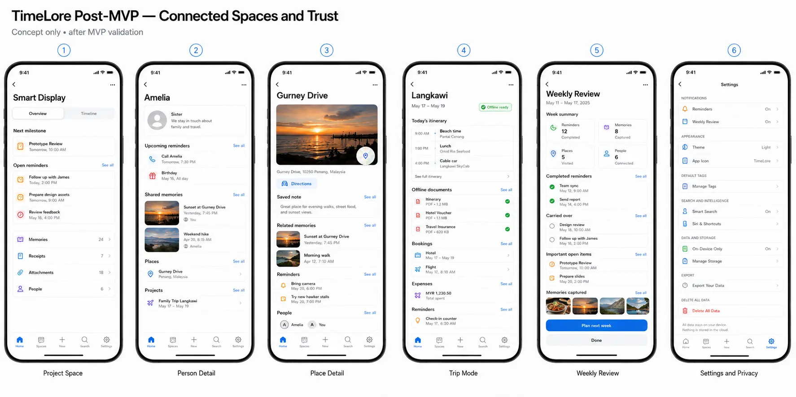

# TimeLore UI Specification

Status: MVP implementation in progress plus gated post-MVP design direction
Platform: iPhone, SwiftUI, iOS 26 visual language  
Primary product name in the current Xcode project: TimeLore  
User-facing design name: TimeLore

## 1. Purpose and authority

This document translates the approved TimeLore boards into an implementation-ready contract. It defines what each page, card, filter, button, gesture, state, and presentation surface does.

- The **MVP is in progress**: the reminder foundation is implemented and under acceptance review; recurrence and reminder attachments are the next actionable slices.
- The **post-MVP sections are concept-only** until the user trial passes the expansion gate.
- The boards establish hierarchy and intent, not fixed pixel measurements.
- Native SwiftUI behavior, safe areas, Dynamic Type, VoiceOver, Reduced Transparency, and the active iOS SDK take precedence over literal screenshot geometry.

## 2. Visual boards

### Beginning phase



Purpose: root hierarchy, tag/filter treatments, Important state, and swipe direction.



Purpose: creation, default tags, reminder detail, overflow actions, delete confirmation, and dark-mode parity.

No approved board currently depicts recurrence or reminder attachments. For those MVP slices, the written page specifications and acceptance criteria in this document control. Use Apple-native repeat controls and system Photos, Files, Contacts, and preview surfaces; do not infer a post-MVP information architecture from the concept boards.

### Post-MVP concept



Purpose: Timeline, Today, Future, Insights, Memory Detail, and New Entry.



Purpose: richer capture types, on-device receipt OCR, global search, and source-grounded answers.



Purpose: Project, Person, Place, Trip, Weekly Review, and Settings/Privacy pages.

## 3. Scope boundary

| Layer | Build now | Defer |
|---|---|---|
| Reminder core | Title, optional Notes, optional due date and repeat rule, Priority, tags, Important, status, timestamps, reminder-scoped photo/file/contact-card attachments | People/place relationships and projects |
| Organization | All, Important, Untagged, tag filters; Open/Completed/Archived | General memory graph |
| Actions | Create, edit, complete/reopen, flag/unflag, archive/restore, delete, attach/preview/remove | Suggestions and predictive timing |
| Find | Local title/Notes search | Semantic and conversational life search; attachment-content indexing |
| Notify | One-time and recurring local notifications | Cross-device or collaborative notifications |
| Storage | SwiftData plus app-owned attachment files, local-only | Cloud sync and accounts |
| UI | Single reminder stack | Timeline/Today/Future/Insights tab architecture |

## 4. Design language

### 4.1 Content layer

- Light mode background: pure white, `#FFFFFF`.
- Dark mode background: true OLED black, `#000000`.
- Reminder tiles use subtle semantic system fills, not translucent glass.
- Use thin semantic separators and generous vertical spacing.
- Use system typography and support Dynamic Type without truncating essential actions.
- Prefer large, calm touch targets over dense dashboard layouts.

### 4.2 Functional Liquid Glass layer

Use the system-provided iOS 26 appearance for:

- Navigation bars and toolbar groups.
- Primary plus/add control.
- Search presentation.
- Sheets and partial-height sheets.
- Overflow menus, popovers, alerts, and confirmation dialogs.
- Transient interactive controls when the system supplies the material.
- Post-MVP floating tab bar.

Do not apply Liquid Glass to:

- Reminder cards.
- Notes content.
- Attachment thumbnails and previews.
- History rows.
- Charts and data cards.
- Project, receipt, memory, or result cards.

Do not build custom blur stacks to mimic the material. Standard SwiftUI structures are the default implementation.

### 4.3 Corner and spacing behavior

- Use concentric rounded geometry where controls sit within rounded sheets.
- Keep a minimum 44-by-44-point interactive target.
- Preserve safe-area insets.
- Use an 8-point spacing rhythm where practical.
- Avoid permanently elevated decorative cards when a list row and separator communicate hierarchy.

## 5. Color and tag system

Color supports recognition but never carries meaning alone. Every chip includes a readable label; Important includes a flag symbol; selected filters have a distinct selected treatment and accessibility value.

| Filter/tag | Semantic treatment | Suggested light tint | Suggested dark tint | Symbol |
|---|---|---:|---:|---|
| All | Neutral aggregate filter | System gray at approximately 14% | System gray at approximately 28% | `tray.full` |
| Important | Cross-tag priority filter | System orange/amber at approximately 16% | System orange/amber at approximately 28% | `flag.fill` |
| Work | Default tag | System blue at approximately 14% | System blue at approximately 28% | `briefcase` |
| Personal | Default tag | System purple at approximately 14% | System purple at approximately 28% | `person` |
| Projects | Default tag | System indigo at approximately 14% | System indigo at approximately 28% | `folder` |
| Grocery | Default tag | System green at approximately 14% | System green at approximately 28% | `cart` |
| Health | Default tag | System pink at approximately 14% | System pink at approximately 28% | `heart` |
| Errands | Default tag | System teal at approximately 14% | System teal at approximately 28% | `checklist` |
| User tag | Deterministic palette assignment | One accessible semantic tint | Matching darker semantic tint | `tag` |

### 5.1 Selected and unselected states

- Unselected chip: tinted background, semantic foreground, normal label weight.
- Selected chip: stronger semantic fill, high-contrast foreground, semibold label, accessibility value “Selected.”
- Important reminders also show a small `flag.fill` near the title.
- A reminder can be Important and have zero, one, or many tags.
- Important is not implemented as a hidden tag.

### 5.2 Default-tag behavior

Seed these exact defaults on first run:

1. Work
2. Personal
3. Projects
4. Grocery
5. Health
6. Errands

Requirements:

- Seeding is idempotent.
- Case-insensitive normalized names prevent duplicates.
- Existing user-created tags are not overwritten.
- Default tags can be selected like any other tag.
- Later tag-management features may rename or hide defaults, but MVP creation and selection must not depend on hard-coded database identifiers.

## 6. Reminder domain additions

Add an explicit persisted Important state:

```swift
var isImportant: Bool
```

Expected default: `false`.

Important is independent of:

- `status` — open or completed.
- `archivedAt` — visible or archived.
- `tags` — zero or more categories.

The value survives:

- Complete and reopen.
- Archive and restore.
- Edit and save.
- Relaunch and SwiftData reload.

Changing Important updates `updatedAt` but must not change `completedAt` or `archivedAt`.

Add an explicit persisted Priority level, separate from Important:

```swift
var priorityRawValue: Int // 0: none, 1: !, 2: !!, 3: !!!
```

Priority defaults to none. Changing it updates `updatedAt` but does not alter completion, archive, tags, or Important. Home keeps its due-date order by default; the user can explicitly choose Priority order from the compact Sort menu.

Add an optional persisted recurrence definition for due reminders. The domain shape may vary, but it must preserve these semantics:

- No repeat is the default.
- A repeat rule cannot be enabled without a due date and time.
- Completing an occurrence preserves that occurrence in history and advances or creates the next occurrence exactly once.
- Recurrence survives edit, archive/restore, app termination, and relaunch without duplicating pending notifications.
- Stopping recurrence does not delete completed occurrence history.
- Calendar calculations use Calendar and timezone-aware date components rather than fixed second offsets.

MVP recurrence rules are custom weekly, monthly, and yearly schedules with no end condition. Weekly schedules choose one weekday; monthly schedules choose day 1–31; yearly schedules choose one month and use the due-date day. A day unavailable in a shorter month occurs on that month’s final day. Repeats retain the local due time. The UI must never silently assume scope: editing and deleting a recurring reminder present This occurrence and This and future occurrences choices.

Add reminder-scoped attachment metadata and app-owned local payload storage for three MVP types:

1. Photo selected explicitly through the system photo picker.
2. File selected explicitly through the system document picker.
3. Contact card selected explicitly through the system contact picker and stored as a local vCard snapshot.

Attachments are optional and independent of Priority, Important, tags, completion, and archive state. Removing an attachment or deleting its owning reminder removes the app-owned payload. The MVP does not request broad Contacts access, keep a live contact relationship, run OCR, index attachment contents, or upload attachments.

Each reminder accepts up to six attachments, with a combined 15 MB local-storage limit. A photo uses the system photo picker; a file uses the system Files picker and opens with Quick Look where the system supports preview; a contact card is stored as a local vCard snapshot. Recurring-reminder attachments belong to the series, not a single occurrence.

## 7. MVP information architecture

```text
Reminder Home
├── Search
├── Filter rail
├── Open section
├── Completed section
├── Archived section
├── New Reminder sheet
│   ├── Repeat controls
│   └── Attachment picker
└── Reminder Detail
    ├── Edit Reminder sheet
    ├── Complete/Reopen
    ├── Flag/Unflag
    ├── Archive/Restore
    ├── Attachment preview
    └── Delete confirmation
```

There is no MVP bottom tab bar.

## 8. MVP page specifications

### 8.1 Reminder Home

Purpose: scan, filter, search, and act on reminders without unnecessary navigation.

| Element | Function | Interaction |
|---|---|---|
| Large “TimeLore” title | Establishes the root | Becomes compact using native navigation behavior while scrolling |
| Plus control | Creates a reminder | Opens the New Reminder sheet |
| Sort control | Chooses Open-reminder ordering | Due date (default) or Priority; visually secondary to Plus |
| Search | Finds title or Notes text locally | Case-insensitive; clearing restores normal sections |
| All chip | Removes tag/priority filter | Shows every reminder inside its status section |
| Important chip | Priority filter | Shows only `isImportant == true` reminders inside each status section |
| Untagged chip | Missing-tag filter | Shows reminders with no tags |
| Tag chip | Category filter | Shows reminders containing that tag |
| Open disclosure | Active work | Expands/collapses independently and persists |
| Completed disclosure | Local history | Expands/collapses independently and persists |
| Archived disclosure | Hidden history | Expands/collapses independently and persists |
| Reminder card | Summary and navigation | Tap opens Reminder Detail; directional swipes reveal actions |

Filter rules:

- Only one top-level filter is active at a time in MVP: All, Important, Untagged, or one tag.
- Search text and the selected filter combine with logical AND.
- Each status section displays the count after search/filtering.
- A filtered empty state says what removed the results and offers “Clear filters.”

### 8.2 Reminder-card anatomy

Display in this order:

1. Completion affordance/status indicator.
2. Optional Important flag.
3. Optional Priority marker (`!`, `!!`, or `!!!`).
4. Title, maximum two lines at standard sizes.
5. Optional Notes preview, maximum two lines.
6. Optional due date with calendar symbol and semantic overdue treatment.
7. Up to the available number of tag chips; overflow can use “+N.”
8. Optional recurrence symbol and attachment count; both include text in accessibility output.
9. Navigation chevron only when needed by the chosen row style.

Do not:

- Use glass behind the card.
- Hide Important inside a tag list.
- Use tag color without a text label.
- Show destructive delete as a card swipe.

### 8.3 Swipe interactions

| Reminder state | Swipe direction | Revealed actions | Full swipe |
|---|---|---|---|
| Open, unarchived | Right | Complete, green, `checkmark` | Allowed |
| Completed, unarchived | Right | Reopen, blue, `arrow.uturn.backward` | Allowed |
| Any unarchived state | Left | Flag or Unflag, amber; Archive, orange | Disabled because two actions are present |
| Archived, not Important | Left | Flag, amber; Restore, blue | Disabled |
| Archived, Important | Left | Unflag, amber; Restore, blue | Disabled |

Direction is part of the product contract:

- Right means status progress: Complete/Reopen.
- Left means organization: Flag/Unflag plus Archive/Restore.

### 8.4 New Reminder sheet

Presentation:

- Opens from the plus control as an inset iOS 26 sheet.
- May expand to a taller detent as content grows.
- Uses a navigation title, Cancel, and Save.

Fields:

| Field/control | Requirement |
|---|---|
| What do you need to do? | Required, trimmed, 1–200 characters |
| Notes | Optional, up to 2,000 characters; visually prominent |
| Set a due date | Off by default |
| Date/time | Visible only when due date is enabled |
| Repeat | Off by default; visible/enabled only when a due date is set |
| Flag as Important | Optional explicit persisted flag, independent of Priority |
| Priority | None, `!`, `!!`, or `!!!`; visually grouped with Flag but independently set |
| Tags | Multi-select default and user tags |
| New tag | Validates, normalizes, selects the created tag |
| Attachments | Add Photo, Add File, or Add Contact Card; show removable local previews before save |
| Save | Validates then persists locally |

Permission behavior:

- Notification permission is not requested at launch.
- Request it only in context after saving the first future-dated reminder.
- Denial never blocks saving.
- A quiet guidance callout offers Open Settings.

### 8.5 Reminder Detail

| Element | Function |
|---|---|
| Title | Primary identity |
| Reminder card | Full title in a non-glass semantic-fill card; no redundant status circle |
| NOTES section | Preserves editable context; show “No notes added” when empty |
| Due row | Shows formatted due date/time |
| Repeat row | Shows the recurrence summary and next occurrence when recurrence is enabled |
| Priority & Flag | Separate controls, grouped closely; Priority uses none, `!`, `!!`, or `!!!` |
| Tags | Shows stable colored chips |
| Attachments | Shows type, accessible name, thumbnail/icon, preview/open action, and explicit removal action |
| History | Created, updated, completed, and archived timestamps when present |
| Overflow menu | Edit, Mark Important/Unflag, Archive/Restore, Delete |
| Complete/Reopen action | Changes only status and completion timestamp |

Delete always presents:

- Title: “Delete this reminder?”
- Message: “This action cannot be undone.”
- Cancel.
- Destructive Delete.

### 8.6 Edit Reminder

- Uses the same fields, validation, tag system, and due-date behavior as New Reminder.
- Existing values are prefilled.
- Cancel discards unsaved edits.
- Saving updates `updatedAt`.
- Editing does not silently reset Priority, Important, status, completion, archive, recurrence, attachments, or tag relationships.
- Editing a recurring reminder must explicitly state whether a change applies to one occurrence or the remaining series whenever that distinction exists.

### 8.7 Empty and error states

| State | Copy/action |
|---|---|
| No reminders at all | “Remember what, and why.” plus add action |
| Filtered empty | “No reminders found” plus Clear filters |
| Blank title | Inline “Enter a reminder title.” |
| Notification denied | “Notifications are off” plus Open Settings |
| No Notes | “No notes added” |
| Tag validation | Inline, adjacent to tag creation |
| Repeat without due date | Inline explanation that a due date is required |
| Attachment import failed | Retains the reminder draft and offers Retry or Remove |
| Attachment unavailable/corrupt | Identifies the unavailable item without blocking access to the reminder |
| Contact access unavailable | Explains that the user can cancel or retry; saving the reminder remains available |

## 9. MVP interaction timelines

### 9.1 Create

```text
Home → Plus → New Reminder → Add title/Notes → Optional date/repeat/tags/Important/attachments
→ Save → Optional notification request → Home with new card
```

### 9.2 Complete and reopen

```text
Open card → Swipe right → Complete → Card moves to Completed
→ Swipe right → Reopen → Card returns to Open
```

### 9.3 Flag and unflag

```text
Card → Swipe left → Flag → flag.fill appears
→ Important filter includes card → Swipe left → Unflag → filter count updates
```

### 9.4 Archive and restore

```text
Card → Swipe left → Archive → Card moves to Archived
→ Archived card → Swipe left → Restore → Card returns to correct status section
```

Archive and restore do not change Important or completion.

### 9.5 Inspect and maintain

```text
Card → Detail → Overflow
├── Edit → Edit sheet → Save → Detail
├── Mark Important/Unflag → Detail updates
├── Archive/Restore → Detail updates
└── Delete → Confirmation → Delete → Home
```

### 9.6 Complete a recurring occurrence

```text
Recurring open reminder → Complete → Completed occurrence remains in history
→ Next occurrence is created or advanced exactly once → One pending local notification is reconciled
```

Stopping recurrence preserves already completed occurrences and cancels future notification work for that series.

### 9.7 Attach and remove context

```text
New/Edit Reminder → Attach → Choose Photo, File, or Contact Card
→ Review local preview → Save → Detail shows attachment
→ Remove → Confirm when data loss is possible → Local payload is cleaned up
```

## 10. MVP accessibility and resilience

- VoiceOver card label combines title, Notes summary, due and repeat state, Priority, Important state, tags, and attachment count in a predictable order.
- Swipe actions have explicit labels and hints.
- Chip accessibility values announce Selected or Not selected.
- Important always has the word and flag symbol; never amber alone.
- Support Dynamic Type through accessibility sizes without clipping Save, Complete, Flag, Archive, Restore, or Delete.
- Respect Increased Contrast, Reduced Transparency, and Reduced Motion.
- Use semantic system colors and verify contrast in pure-white and OLED-black modes.
- Persist section expansion, Priority, Important, tags, recurrence, attachment metadata, sort/filter choices where intended, and reminder state.
- Attachment controls announce type, display name, import state, and available actions; thumbnails are never the only label.
- System Photos, Files, and Contacts pickers remain user-initiated and provide clear cancel behavior.
- Test locale, 12/24-hour time, long tag names, long titles, and VoiceOver rotor navigation.

## 11. MVP implementation order

1. Add and test persisted `isImportant`.
2. Add idempotent default-tag seeding and stable presentation tokens.
3. Add Important filter and final filter ordering.
4. Update reminder-card anatomy.
5. Implement exact swipe direction and action combinations.
6. Update detail and overflow actions.
7. Adopt system iOS 26 navigation/presentation materials.
8. Validate light/dark, accessibility, persistence, and UI tests.
9. Add recurring reminder domain rules, editor/detail UI, occurrence history, and notification reconciliation.
10. Add local photo, file, and contact-card attachment import, preview, removal, cleanup, and failure handling.
11. Run the integrated MVP acceptance audit and founder-device trial.

## 12. MVP acceptance criteria

This checklist remains open until each item has been exercised against the current build. Existing reminder behavior is under acceptance review; recurrence and attachment criteria are approved but not yet implemented.

- [ ] Swipe right completes an open reminder.
- [ ] Swipe right reopens a completed reminder.
- [ ] Swipe left shows Flag/Unflag and Archive on unarchived reminders.
- [ ] Swipe left shows Flag/Unflag and Restore on archived reminders.
- [ ] Important persists across every status and lifecycle transition.
- [ ] Important filtering works across Open, Completed, and Archived.
- [ ] Priority persists independently of Important, lifecycle transitions, and relaunch.
- [ ] Sort menu defaults to Due date and supports explicit Priority ordering.
- [ ] All, Important, and tag chips are visually and semantically distinct.
- [ ] Default tags are seeded once without duplicates.
- [ ] Color is never the only indicator.
- [ ] Liquid Glass is limited to functional navigation/presentation surfaces.
- [ ] No bottom tab bar appears in the MVP.
- [ ] Pure-white and OLED-black content layers both pass accessibility checks.
- [ ] Delete remains confirmed and is not a full swipe.
- [ ] Repeat is off by default and cannot be enabled without a due date.
- [ ] Completing a recurring occurrence preserves history and produces exactly one next occurrence.
- [ ] Recurrence edits, stopping, archiving, deletion, relaunch, timezone changes, and notification reconciliation do not duplicate or lose occurrences.
- [ ] A user can add, preview, persist, and remove a photo, file, or contact-card attachment.
- [ ] Attachments remain available offline after relaunch and preserve their type and accessible display name.
- [ ] Removing an attachment or deleting its reminder cleans up app-owned payload data without affecting other reminders.
- [ ] Attachment import denial, cancellation, missing data, and corrupt data never discard the reminder draft or block reminder access.
- [ ] No OCR, attachment-content indexing, upload, broad Contacts access, or live contact syncing is introduced.

---

# Post-MVP Concept

## 13. Expansion gate

Do not implement the pages below until the expanded MVP—including recurring reminders and basic reminder attachments—passes acceptance review and a two-week trial demonstrates that users repeatedly add and retrieve context. When the gate passes, select one coherent experiment rather than implementing the entire concept.

## 14. Mature information architecture

### 14.1 Primary navigation

| Destination | Purpose | Primary cards/options |
|---|---|---|
| Timeline | Unified chronological life view | Reminder, memory, receipt, note, place and project event cards |
| Today | Focused daily plan | Date strip, all-day items, schedule, completed disclosure |
| Future | Upcoming and suggested work | Next 7 Days, Later, Suggested cards |
| Insights | Understand useful patterns | Completion, capture, category and timing summaries |
| Search | Retrieve across life data | Query, type filters, results, source-grounded answer |

The floating Liquid Glass tab bar appears only after the expansion gate.

## 15. Post-MVP core pages

### 15.1 Timeline

Elements:

- Today, Tomorrow, and Later date groups.
- Mixed item cards with type icon, time/date, title, context preview, tags, and Important flag.
- Plus action opens New Entry.
- Tap a card opens the correct typed detail.
- Filters narrow by type without changing stored data.

Card types:

| Type | Card action |
|---|---|
| Reminder | Complete, flag, archive, inspect |
| Memory | Favorite, connect, inspect |
| Receipt | Review merchant/amount, connect, inspect |
| Note | Edit, connect, inspect |
| Place | Open place detail |
| Project event | Open project space at the related milestone |

### 15.2 Today

- Date strip changes the selected day.
- All-day tile shows birthdays and date-only reminders.
- Schedule lists timed items.
- Completed disclosure retains same-day history.
- Tapping time opens detail; swiping reminder rows retains MVP semantics.

### 15.3 Future

- Next 7 Days and Later are user-owned commitments.
- Suggested is visually separate and never silently creates data.
- Each suggestion shows why it appeared.
- Plus accepts a suggestion into a real reminder.
- Dismiss removes or mutes the suggestion without deleting source memories.

### 15.4 Insights

- Completion tile: descriptive activity, not a gamified score.
- Capture tile: memories or contexts captured.
- Weekly pattern: transparent aggregation of local data.
- Top categories: derived from tags.
- Explanation card states why the observation may matter.
- Every insight can open the underlying items.

### 15.5 Memory Detail

- Media header.
- Title, date/time, place, people, project, tags.
- Memory narrative.
- Related reminders and source evidence.
- Share, favorite, edit, and delete.
- Delete is confirmed; share exposes only selected content.

### 15.6 New Entry

| Entry type | Opens |
|---|---|
| Reminder | Mature reminder editor |
| Memory | Memory Capture |
| Note | Note editor |
| Place | Place saver/search |
| Person | Person editor |
| Photo | Photo attachment/import |
| Receipt | Receipt Camera |

## 16. Post-MVP capture and life search

### 16.1 Memory Capture

- Title.
- Narrative text.
- Date/time.
- Optional place, people, and project relationships.
- Photos.
- Tags.
- Save.

Relationship fields are explicit and user-controlled. Automatic suggestions require confirmation.

### 16.2 Receipt Camera

- Camera viewfinder and edge guides.
- Shutter, flash, and gallery import.
- “Processed on device” privacy status.
- Retake and Use Photo actions.
- No receipt is persisted until review is confirmed.

### 16.3 Receipt Review

| Element | Function |
|---|---|
| Merchant/date/total | Editable extracted values |
| Confidence | High/medium/low, with uncertain values emphasized |
| Line items | Expandable item list |
| Tax/payment | Optional extracted metadata |
| Tags/project | User relationships |
| Original image | Source evidence |
| Save Receipt | Persists corrected result and provenance |

### 16.4 Global Search

Type filters:

- All
- Reminders
- Memories
- Receipts
- Projects
- People
- Places

Results are grouped by type. Exact keyword results remain available even when semantic search is enabled.

### 16.5 Answer View

- Shows the interpreted question.
- Gives a concise answer only from approved TimeLore data.
- Displays source-linked evidence cards.
- “Open original” navigates to evidence.
- Provides correction and feedback.
- Never includes private items outside the active visibility boundary.

## 17. Post-MVP connected spaces

### 17.1 Project Space

| Section | Function |
|---|---|
| Overview | Current state and context |
| Timeline | Chronological project events |
| Next milestone | Highest-priority milestone |
| Open reminders | Project-related action items |
| Memories | Decisions and contextual records |
| Receipts | Project purchases |
| Attachments | Photos and documents |
| People | Related people |

### 17.2 Person Detail

- Name and user-written relationship note.
- Upcoming reminders.
- Related memories.
- Places and projects.
- No automatic contact access without explicit permission.

### 17.3 Place Detail

- Photo or map header.
- Saved note.
- Related memories, reminders, people, and projects.
- Directions launches the system mapping experience.
- Location history is never collected silently.

### 17.4 Trip Mode

- Trip dates and Today’s itinerary.
- Offline-ready documents.
- Bookings, expenses, reminders, and related people.
- Timezone-aware scheduling.
- Offline status must be explicit and testable.

### 17.5 Weekly Review

- Week summary.
- Completed reminders.
- Carried-over items.
- Memories captured.
- Important open items.
- Plan next week opens an editable plan.
- Done dismisses without modifying reminders.

### 17.6 Settings and Privacy

| Section | Controls |
|---|---|
| Notifications | Reminder and review permissions |
| Appearance | System/light/dark and app icon |
| Default Tags | Manage visible defaults and user tags |
| Search and Intelligence | Indexing, semantic search, suggestions, Siri/Shortcuts |
| Data and Storage | On-device status, storage usage, attachment management |
| Export | Portable user data |
| Delete All Data | Destructive confirmed local/synced deletion |

## 18. Post-MVP trust requirements

- AI answers cite source items.
- OCR stores original evidence and user corrections.
- Suggestions explain why they appeared and require acceptance.
- Imported data records provenance.
- Shared visibility is explicit.
- Export and deletion are product features.
- On-device processing is preferred for sensitive content.
- Cloud or external processing requires clear consent and settings.

## 19. Agent handoff rule

When implementing a task:

1. State whether it is MVP or post-MVP.
2. Identify the page and acceptance criteria in this document.
3. Treat recurrence and reminder-scoped photo/file/contact-card attachments as MVP; refuse other accidental scope expansion from concept boards.
4. Use Apple-native components before introducing custom UI.
5. Add accessibility identifiers and tests for every changed interaction.

The post-MVP boards are a coherent future design system, not a single implementation milestone.
